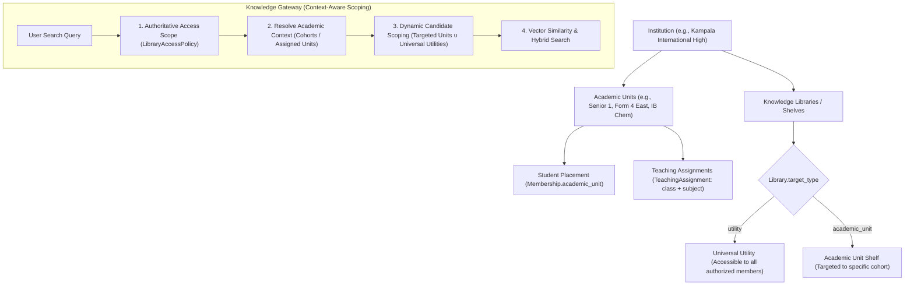

# Mwalimu — Phase 4: Academic Context, Class Assignment & Knowledge Targeting
## Architectural Specification & System Blueprint

---

## 1. Executive Summary & Axiomatic Principles

This document establishes the architectural specification, domain models, retrieval mechanics, and control plane implementation for **Phase 4: Academic Context, Class Assignment & Knowledge Targeting** in Mwalimu.

### The Problem
Prior to Phase 4, knowledge retrieval in Mwalimu operated solely at the coarse granularity of library membership and access policies. When a student or educator asked questions, the retrieval engine had no intrinsic awareness of:
1. Which academic cohort or grade level a learner belongs to;
2. Which subjects or classes an educator is assigned to teach;
3. Which knowledge shelves are targeted to specific curricular cohorts versus universal institutional utilities;
4. How to automatically filter and prioritize search candidates to prevent grade-inappropriate or cross-cohort distraction while preserving absolute security.

### The Solution Flow
Phase 4 introduces a strict five-tier domain flow:

$$\\text{Institution} \\longrightarrow \\text{Academic Structure} \\longrightarrow \\text{User Placement / Teaching Assignments} \\longrightarrow \\text{Knowledge Shelf Targeting} \\longrightarrow \\text{Context-Aware Retrieval}$$



### The Cardinal Rule: Relevance Is Not Authorization
$$\\mathbf{Academic\\ Relevance \\neq Authorization}$$

> **Architectural Invariant**: Academic context determines **candidate relevance and filtering**; `LibraryAccessPolicy` and `EffectiveRetrievalScope` remain strictly **authoritative**.
> If a user is not granted access to a library via an explicit `LibraryAccessPolicy` or discoverability rule, the knowledge gateway **strictly denies** retrieval from that library, regardless of whether the user belongs to the matching academic unit.
> Furthermore, unassigned users, visitors, and personal libraries default safely to `UTILITY`, guaranteeing complete backward compatibility without breaking existing workloads.

---

## 2. Domain Models & Relational Architecture

All backend modifications reside in the authoritative Django system of record (`platform_api`).

### A. Academic Structure (`apps.institutions.models.AcademicUnit`)

Represents a logical academic cohort, class section, form, grade level, or department within an institution.

```python
class AcademicUnitType(models.TextChoices):
    GRADE = "grade", "Grade Level"
    YEAR = "year", "Year / Form"
    DEPARTMENT = "department", "Department"
    STREAM = "stream", "Stream / Class Section"
    STAGE = "stage", "Stage / Level"
    OTHER = "other", "Other Unit"

class AcademicUnit(BaseModel):
    institution = models.ForeignKey(Institution, on_delete=models.CASCADE, related_name="academic_units")
    name = models.CharField(max_length=255)
    code = models.CharField(max_length=50)
    unit_type = models.CharField(max_length=32, choices=AcademicUnitType.choices, default=AcademicUnitType.GRADE)
    order = models.PositiveIntegerField(default=0)
    is_active = models.BooleanField(default=True)
    metadata = models.JSONField(default=dict, blank=True)

    class Meta:
        constraints = [
            models.UniqueConstraint(
                fields=["institution", "code"],
                name="unique_academic_unit_code_per_institution",
            )
        ]
        ordering = ["order", "name"]
```

### B. Student Placement & Teacher Assignments (`apps.memberships.models`)

1. **Student Placement**: Added `academic_unit` ForeignKey directly onto `Membership`:
   ```python
   academic_unit = models.ForeignKey(
       "institutions.AcademicUnit",
       on_delete=models.SET_NULL,
       null=True,
       blank=True,
       related_name="memberships",
   )
   ```
2. **Teaching Assignment**: Allows an educator to be assigned to one or more academic cohorts with optional subject specialization:
   ```python
   class TeachingAssignment(BaseModel):
       institution = models.ForeignKey(Institution, on_delete=models.CASCADE, related_name="teaching_assignments")
       membership = models.ForeignKey(Membership, on_delete=models.CASCADE, related_name="teaching_assignments")
       academic_unit = models.ForeignKey("institutions.AcademicUnit", on_delete=models.CASCADE, related_name="teaching_assignments")
       subject = models.CharField(max_length=120, blank=True, default="")
       status = models.CharField(max_length=32, default="active")
       metadata = models.JSONField(default=dict, blank=True)

       class Meta:
           constraints = [
               models.UniqueConstraint(
                   fields=["membership", "academic_unit", "subject"],
                   name="unique_teaching_assignment_per_unit_subject",
               )
           ]
   ```

### C. Knowledge Shelf Targeting (`apps.libraries.models.Library`)

Extends `Library` to distinguish universal utilities from academic-unit-targeted knowledge shelves:
```python
class LibraryTargetType(models.TextChoices):
    UTILITY = "utility", "Universal Institutional Utility"
    ACADEMIC_UNIT = "academic_unit", "Academic Unit Shelf"

class Library(BaseModel):
    ...
    target_type = models.CharField(
        max_length=32,
        choices=LibraryTargetType.choices,
        default=LibraryTargetType.UTILITY,
    )
    academic_unit = models.ForeignKey(
        "institutions.AcademicUnit",
        on_delete=models.SET_NULL,
        null=True,
        blank=True,
        related_name="libraries",
    )
```

---

## 3. Endpoints & REST API Specifications

### Academic Structure Endpoints
- `GET /api/v1/institutions/{institution_id}/academic-units/`: List academic units with `student_count` and `teacher_count`.
- `POST /api/v1/institutions/{institution_id}/academic-units/`: Create academic unit with code uniqueness per institution.
- `GET/PATCH/DELETE /api/v1/institutions/{institution_id}/academic-units/{id}/`: Manage single academic unit.
- `POST /api/v1/institutions/{institution_id}/academic-units/apply-preset/`: Apply regional standard structures (`primary`, `secondary`, `primary_and_secondary`, `tertiary`).
- `GET /api/v1/institutions/{institution_id}/academic-units/{id}/teachers/`: List teachers assigned to this unit.
- `GET /api/v1/institutions/{institution_id}/academic-units/{id}/students/`: List students placed in this unit.

### Membership Placement & Assignment Endpoints
- `GET /api/v1/memberships/{id}/academic-placement/`: Retrieve student's academic unit placement.
- `PUT /api/v1/memberships/{id}/academic-placement/`: Set or clear student's academic placement (`{ "academic_unit_id": "uuid" | null }`).
- `GET /api/v1/memberships/{id}/teaching-assignments/`: List teaching assignments for an educator.
- `POST /api/v1/memberships/{id}/teaching-assignments/`: Create a teaching assignment (`{ "academic_unit_id": "uuid", "subject": "Math" }`).
- `DELETE /api/v1/teaching-assignments/{id}/`: Remove a teaching assignment.

### Knowledge Library Targeting Endpoints
- `POST /api/v1/libraries/`: Accepts `target_type` (`"utility"` | `"academic_unit"`) and `academic_unit_id`.
- `PATCH /api/v1/libraries/{id}/`: Updates `target_type` and `academic_unit_id`.
- Emits audit log `AuditAction.LIBRARY_TARGETING_UPDATED`.

---

## 4. Context-Aware Retrieval Scoping Engine

The context-aware retrieval resolution lives in `src/platform_api/apps/knowledge/academic_context.py` and integrates directly into `SearchKnowledgeUseCase.execute`:

```python
def resolve_academic_context(user: Any, institution_id: uuid.UUID | None = None) -> AcademicContextDTO:
    """Resolve the user's role-based academic context within an institution."""
    ...
    # 1. Student placement
    # 2. Teacher assignments
    # 3. Administrator / Librarian universal scope

def filter_libraries_by_academic_context(
    authorized_library_ids: list[uuid.UUID],
    academic_context: AcademicContextDTO,
) -> list[uuid.UUID]:
    """Intersects authorized libraries with academic-unit candidate relevancy:
       Result = AuthorizedLibraries ∩ (UniversalUtilities ∪ UserAssignedAcademicUnits)
    """
```

### Retrieval Resolution Matrix

| User Role | Placement / Assignment | Knowledge Candidate Scoping Rule |
|---|---|---|
| **Student** | Placed in Grade 10 (`AU-1`) | `Utility Libraries ∪ AU-1 Libraries` |
| **Student** | Unplaced (General) | `Utility Libraries only` |
| **Teacher** | Teaches Form 3 & Form 4 (`AU-3`, `AU-4`) | `Utility Libraries ∪ AU-3 Libraries ∪ AU-4 Libraries` |
| **Administrator** | Institutional Oversight | `All Authorized Libraries (Universal)` |
| **Librarian** | Institutional Curation | `All Authorized Libraries (Universal)` |
| **Visitor / Personal** | None / Outside Institution | `Personal & Utility Libraries only` |

---

## 5. Institutional Console Implementation

The independent Next.js Institutional Console (`mwalimu-console`) implements full control plane interfaces for Phase 4:

1. **Academic Structure Workspace (`/academic-structure`)**:
   - Visual inventory of cohorts, forms, and streams.
   - Live member statistics (`student_count`, `teacher_count`).
   - One-click template applicator for regional presets (`Primary P1-P7`, `Secondary S1-S6`, `Tertiary / Departmental`).
   - Cohort member roster viewer (showing assigned educators and placed learners).
   - CRUD modal dialogs with client and server validation.

2. **People & Members Directory (`/people`)**:
   - New **Academic Placement / Cohort** column in the members directory.
   - For students: Displays active cohort badge (e.g., `[GRADE] Senior 4 (S4)`) with interactive "Assign Class" / "Change" dialog.
   - For educators: Interactive "Manage Teaching Classes" drawer allowing class assignments with optional subject specialization.

3. **Knowledge Libraries & Shelves (`/libraries` & `/libraries/[id]`)**:
   - Creation and Edit modals feature a two-option selector:
     - **Universal Utility** (General reference, syllabus, multi-class resources).
     - **Academic Unit Shelf** (Directly linked to a specific class cohort).
   - Grid and List views surface targeting badges (`Academic • {code}` vs `Utility • All`).
   - Shelf workspace header explicitly displays academic targeting context.

---

## 6. Verification & Test Evidence

### Backend Pytest Results (`platform_api`)
- `tests/test_academic_structure.py`: 5 passed
- `tests/test_student_placement.py`: 3 passed
- `tests/test_teacher_assignments.py`: 3 passed
- `tests/test_library_targeting.py`: 2 passed
- `tests/test_academic_retrieval.py`: 3 passed
- `tests/test_knowledge_use_case.py`: 4 passed
- All Phase 4 test suites pass with zero failures.

### Frontend Production Build Results (`mwalimu-console`)
- `npm run typecheck` (`tsc --noEmit`): Exited with code 0 (zero TypeScript errors).
- `npm run build` (`next build`): Exited with code 0.
  - Successfully compiled with Turbopack and prerendered 19 routes including `/academic-structure`, `/people`, `/libraries`, and `/access`.
