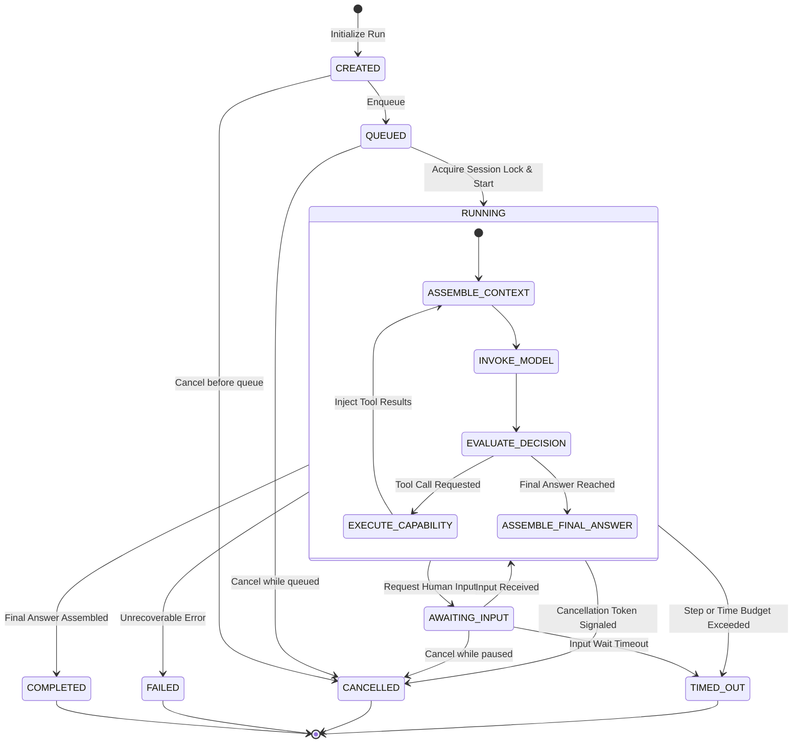

# ADR-013: AgentRun State Machine & Lifecycle

## Status

Accepted (Design Phase — Slice 6 Revision)

## Context

An agent execution is an asynchronous, multi-step process that coordinates model inferences and capability executions. An execution run can encounter model latency, tool execution delays, transient network failures, client cancellation, worker crashes, or budget exhaustion.

We must define a deterministic, formal finite state machine for `AgentRun` instances with exactly 8 states, explicit legal transitions, clear transition ownership, and well-defined terminal state semantics.

## Decision

We define an explicit 8-state finite state machine for `AgentRun` with unambiguous transition ownership and terminal guarantees.

### 1. The 8 State Definitions

| State | Category | Description |
|---|---|---|
| `CREATED` | Initial | Run initialized, inputs and configuration validated, not yet enqueued. |
| `QUEUED` | Intermediate | Enqueued in task executor awaiting an execution slot and session lock. |
| `RUNNING` | Intermediate | Actively executing the agent reasoning loop (model inference or capability execution). |
| `AWAITING_INPUT` | Intermediate (Pausable) | Suspended awaiting human input or external approval in interactive workflows. |
| `COMPLETED` | Terminal | Finished successfully with a synthesized final answer and citation evidence. |
| `FAILED` | Terminal | Aborted due to an unrecoverable error (e.g., model provider failure, internal error, worker crash). |
| `CANCELLED` | Terminal | Explicitly terminated by an authorized cancellation request before natural completion. |
| `TIMED_OUT` | Terminal | Aborted due to exceeding the configured execution time budget or step budget. |

### 2. State Transition Matrix & Transition Owners

| From State | To State | Trigger / Condition | Transition Owner |
|---|---|---|---|
| `CREATED` | `QUEUED` | Run accepted and enqueued | `RunAgentUseCase` |
| `CREATED` | `CANCELLED` | Cancel request before dispatch | `CancelRunUseCase` |
| `QUEUED` | `RUNNING` | Worker acquires session lock & starts Step 0 | `AgentExecutionCoordinator` |
| `QUEUED` | `CANCELLED` | Client cancels while waiting in queue | `CancelRunUseCase` |
| `RUNNING` | `RUNNING` | Step cycle completed; next step initiated | `ReasoningLoopEngine` |
| `RUNNING` | `AWAITING_INPUT`| Model requests human input/confirmation | `ReasoningLoopEngine` |
| `AWAITING_INPUT`| `RUNNING` | User provides required input | `RunAgentUseCase` |
| `AWAITING_INPUT`| `CANCELLED` | User cancels while suspended | `CancelRunUseCase` |
| `AWAITING_INPUT`| `TIMED_OUT` | Input wait timeout exceeded | `TimeoutMonitor` |
| `RUNNING` | `COMPLETED` | Model produces final response / stop token | `ReasoningLoopEngine` |
| `RUNNING` | `FAILED` | Unrecoverable error or unhandled exception | `AgentExecutionCoordinator` |
| `RUNNING` | `CANCELLED` | Cancellation token signaled | `AgentExecutionCoordinator` |
| `RUNNING` | `TIMED_OUT` | Max steps (e.g., 10) or timeout (e.g., 60s) exceeded | `TimeoutMonitor` / `ReasoningLoopEngine` |

### 3. State Transition Diagram

### 4. Transition Guarantees

1. **Terminal Immutability**: `COMPLETED`, `FAILED`, `CANCELLED`, `TIMED_OUT` are strictly terminal. No transitions out of terminal states are permitted.
2. **Cooperative Cancellation**: Cancellation is signaled via an `asyncio.Event` cancellation token. The `ReasoningLoopEngine` inspects the token before every model invocation and capability execution.
3. **Budget Guards**: If `current_step > max_steps` or elapsed time exceeds `timeout_seconds`, the coordinator forces an immediate transition to `TIMED_OUT`.
4. **Crash Recovery Semantics**: If a worker node crashes while an `AgentRun` is in state `RUNNING` or `QUEUED`, any subsequent `GET /runs/{id}` poll or heartbeat monitor detects the stale lease and marks the run as `FAILED` with error code `WORKER_CRASHED`.

## Consequences

### Positive

- Complete clarity on the exact 8 states and all permitted state transitions.
- Explicit transition ownership avoids race conditions between API controllers and worker loops.
- Deterministic handling of cancellation, timeouts, and worker crashes.

### Negative

- Cooperative cancellation requires check points before each async boundary in the reasoning loop.

## Related Decisions

- [ADR-012: Agent Runtime Boundary](ADR-012-agent-runtime-boundary.md)
- [ADR-014: Execution Context & Identity](ADR-014-execution-context-and-identity.md)
- [ADR-016: Capability / Tool Architecture](ADR-016-capability-tool-architecture.md)
