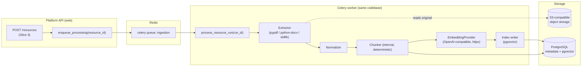
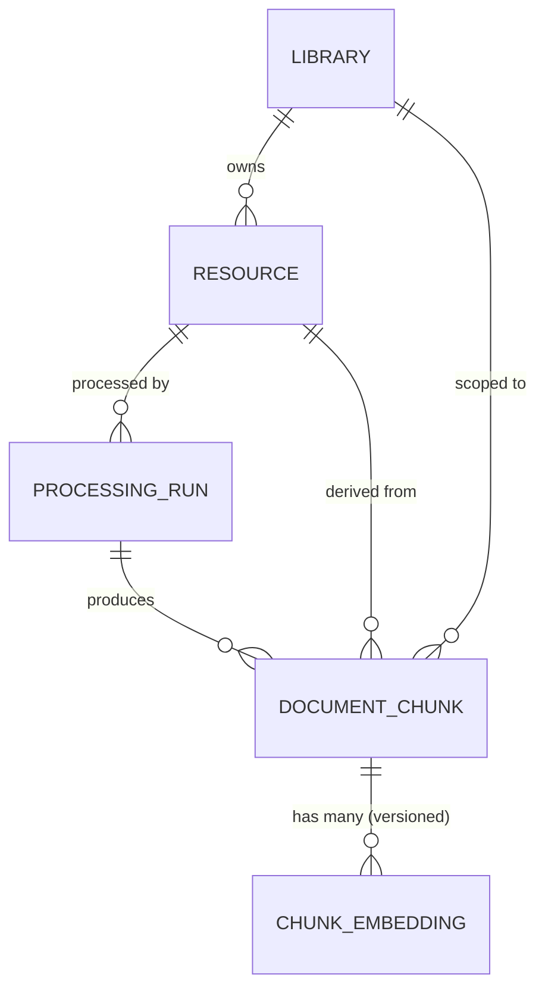
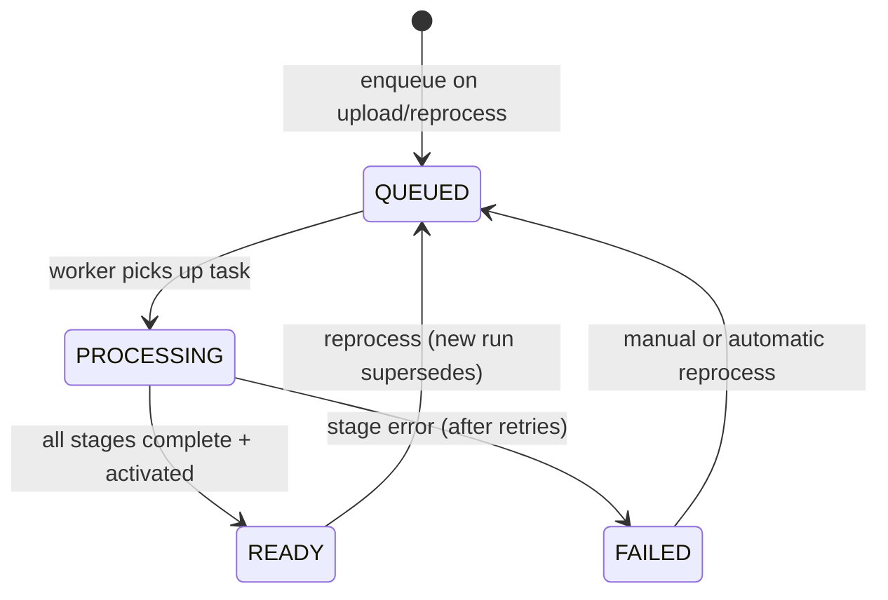

# Slice 4 Design — Document Processing + Knowledge Indexing

Status: **Approved with review amendments incorporated. No implementation in
this document.**

Amendments incorporated after design review:

1. Chunk embeddings are versioned per chunk (`embedding_model`,
   `embedding_version`, `dimensions`); a chunk is not limited to one embedding
   for all time (§2, §9, §10, §11).
2. The embedding provider boundary is absolute: domain code depends only on the
   `EmbeddingProvider` protocol (§8).
3. 1536 dimensions is an MVP deployment value, not a Mwalimu-wide invariant (§8,
   §9).
4. Redis locks are an optimization; correctness comes from database constraints
   and idempotent processing (§4, §10).
5. Authorization before vector search is a hard architectural invariant (§9,
   §14).
6. Empty extraction is `FAILED` + `error_code=EMPTY_EXTRACTION` (§5, §12).
7. Deterministic chunk identity is guaranteed by the full processing identity
   tuple (§7, §10).
8. Processing version identity distinguishes source, pipeline, extractor,
   chunker, embedding model, and embedding version (§2, §10, §11).
9. `Resource` is never extended with processing fields (§2).

This document defines the pipeline that transforms a `Resource` into searchable
knowledge:

```
Resource → extraction → normalization → chunking → embedding → pgvector indexing → READY_FOR_SEARCH
```

It follows the existing platform axioms:

- A **Library** is a logical knowledge/security boundary, not a database, schema,
  vector store, embedding service, or deployment.
- Processing operates on **Resources**. Logical isolation is expressed through
  `library_id`, `resource_id`, chunk/resource relationships, and existing
  authorization policies.
- The vector store is **not** an authorization layer. Every query is scoped by
  authorized library/resource IDs before results are produced.
- Authorization decisions are made by the Platform API, never by similarity
  scores and never by an LLM.

---

## 1. Component architecture

All processing components live **inside the Platform API codebase** and execute
on Celery workers. No new service is introduced.



### Components and responsibilities

| Component | Type | Responsibility |
|---|---|---|
| `Extractor` (per type) | internal module | Resource bytes → raw structured text (pages, paragraphs, headings) |
| `Normalizer` | internal module | raw text → canonical clean text with preserved structure |
| `Chunker` | internal module | normalized text → deterministic `DocumentChunk` records |
| `EmbeddingProvider` | interface + impl | chunk texts → vectors |
| Index writer | internal module | persist chunks + vectors transactionally |
| `process_resource_run` | Celery task | orchestrates the stages above, idempotently |

**Boundary rule:** components are plain Python modules in a `processing` package
inside the Platform API. They are importable by both the web process (for
enqueueing/status) and the worker process (for execution). They never talk to
the Agent Service, MCP, or the network except through `EmbeddingProvider` and
the existing `ObjectStorage` abstraction.

---

## 2. Data model

Three new models: `ProcessingRun`, `DocumentChunk`, `ChunkEmbedding`.

**Hard invariant — `Resource` is not modified.** `Resource` remains the
source-of-truth metadata model (identity, type, size, storage key, checksum,
upload lifecycle). No processing-specific fields are ever added to it: no run
status, no pipeline versions, no chunk/embedding counts. Anything about
processing lives on the models below and reaches `Resource` only through
foreign keys.

### 2.1 Field ownership

| Concern | Owner model | Rationale |
|---|---|---|
| Domain identity, name, type, size, storage key, checksum, upload lifecycle | `Resource` (existing, unchanged) | Established in Slice 3 |
| Processing identity, source/pipeline/extractor/chunker/model/version identity, run status, errors, timing | `ProcessingRun` | A run is one execution of a specific pipeline against a specific source checksum |
| Chunk text, order, provenance (page/section/offsets), token count | `DocumentChunk` | Chunks are facts derived from one run of one resource |
| Vector, embedding model, embedding version, dimensions | `ChunkEmbedding` | Vectors are versioned index data, separable from provenance |

Explicit non-goals: no extraction artifacts on `Resource`; no chunk fields on
`ProcessingRun`; no embedding fields on `DocumentChunk`.

### 2.2 `ProcessingRun`

| Field | Notes |
|---|---|
| `id` | UUID PK |
| `resource` | FK → Resource, CASCADE |
| `library` | FK → Library (denormalized from resource, indexed; scoping + reporting) |
| `status` | `QUEUED` / `PROCESSING` / `READY` / `FAILED` |
| `current_stage` | `EXTRACT` / `NORMALIZE` / `CHUNK` / `EMBED` / `INDEX` / `FINALIZE` / null — observability only |
| `source_checksum` | Copied from `Resource.checksum` at run creation — part of processing identity |
| `pipeline_version` | e.g. `"1"` — covers normalization + orchestration logic |
| `extractor_version` | e.g. `"pypdf-1"` — distinguishes extractor implementation changes from pipeline changes |
| `chunker_version` | e.g. `"1"` — covers chunker parameters/configuration |
| `embedding_model` | e.g. `"text-embedding-3-small"` — provider-reported model identity |
| `embedding_version` | e.g. `"1"` — distinguishes generations of embeddings for the *same* model (prompt/preprocessing/normalization changes) |
| `embedding_dimensions` | e.g. `1536` — provider-reported, persisted for verification |
| `is_active` | bool; at most one active run per resource (partial unique index) |
| `celery_task_id` | correlation for observability |
| `attempt_count` | incremented per execution |
| `error_code` / `error_message` | machine + human failure detail |
| `queued_at` / `started_at` / `finished_at` / `created_at` / `updated_at` | timestamps |

**Processing identity (unique):** `(resource, source_checksum, pipeline_version,
extractor_version, chunker_version, embedding_model, embedding_version)`.

This tuple distinguishes changes in **source content, pipeline, extractor,
chunker, embedding model, and embedding version** independently. A second run
with an identical identity and a `READY` status is a no-op; see §10–§11.

### 2.3 `DocumentChunk`

| Field | Notes |
|---|---|
| `id` | UUID PK |
| `processing_run` | FK → ProcessingRun, CASCADE |
| `resource` | FK → Resource (denormalized; direct scoping + simpler constraints) |
| `library` | FK → Library (denormalized, indexed; mandatory for scoped search) |
| `sequence` | int, order within the run; unique per run |
| `text` | chunk text |
| `token_count` | int, estimated (see §7) |
| `char_start` / `char_end` | offsets into the normalized text |
| `page_start` / `page_end` | nullable; PDFs only |
| `section` | nullable; nearest enclosing heading path |
| `content_sha256` | chunk text digest — verification + retry dedup aid |

### 2.4 `ChunkEmbedding`

| Field | Notes |
|---|---|
| `id` | UUID PK |
| `chunk` | **FK** → DocumentChunk, CASCADE — a chunk may accumulate **multiple versioned embeddings** over its lifetime |
| `vector` | `VectorField(dimensions=…)` (pgvector) — 1536 for the MVP deployment; see §8.3/§9.1 |
| `embedding_model` | e.g. `"text-embedding-3-small"` — part of embedding identity |
| `embedding_version` | e.g. `"1"` — part of embedding identity; distinguishes re-embedding generations of the same model |
| `dimensions` | copied from the provider at write time; guards against dimension mismatch at query time |
| `created_at` | timestamp |

**Embedding identity (unique):** `(chunk, embedding_model, embedding_version)`.
A `DocumentChunk` is therefore **not** conceptually limited to exactly one
embedding for all time: re-embedding with a new model or a new embedding
version creates a new row instead of destroying the old one, so rollback and
audit stay cheap. The **active `ProcessingRun`** (its `embedding_model` +
`embedding_version`) determines which embedding generation is searchable —
see §9.3.

Vectors are stored centrally in PostgreSQL/pgvector. There is **no** vector
table per library and **no** separate vector service. Scoping happens through
`DocumentChunk.library_id` / `resource_id` joins, enforced by the (future)
Knowledge Gateway — never by the vector index itself.



---

## 3. Processing state machine

Resource lifecycle (`PENDING/UPLOADING/READY/FAILED/ARCHIVED`, Slice 3) and
processing lifecycle are **separate**. `READY` on a Resource means "binary is
stored"; it does not mean "searchable". Search readiness is derived from the
**active `ProcessingRun`**.



- **Exactly four states** are justified. Per-stage states (`EXTRACTING`,
  `CHUNKING`, …) would multiply transition logic without changing behavior; the
  current stage is already observable via `current_stage`.
- **`READY` semantics:** the run's chunks/embeddings are complete **and** the
  run has been atomically activated (`is_active=True`, previous active run
  deactivated in the same transaction).
- **FAILED** is terminal for that run; a *new* run is created to retry the
  resource (the same row is not resurrected — clean audit trail).

---

## 4. Celery task architecture

### 4.1 One orchestrating task, internal stages

**Decision:** a single Celery task `process_resource_run(run_id)` that calls
pure, separately unit-testable stage functions in-process:

```
extract → normalize → chunk → embed → index/activate
```

**Not** a Celery `chain` of five tasks. Rationale:

- Stages pass large intermediate data (full document text). Passing it through
  Redis is wasteful and fragile; passing IDs and re-deriving in each task
  duplicates work per retry anyway.
- Celery canvas retry semantics operate per task; a chain makes "resume from
  the failed stage" harder, not easier, once intermediate data must be
  persisted.
- Stage functions remain independently testable and could be split into
  separate tasks later if a specific stage (e.g., embedding) needs its own
  scaling profile — without changing the domain model.

### 4.2 Task configuration

| Concern | Design |
|---|---|
| Retry | `autoretry_for` transient errors (network, provider 5xx/429, DB deadlocks), exponential backoff with jitter, `max_retries=5` |
| Ack | `acks_late=True`, `reject_on_worker_lost=True` — a crashed worker re-queues the task |
| Timeouts | soft time limit (e.g., 10 min) + hard limit (15 min); soft limit raises a catchable exception so the run is marked `FAILED` cleanly |
| Backpressure | dedicated queue `ingestion` with its own worker pool and `worker_prefetch_multiplier=1`; provider rate limits handled inside the embedding stage with bounded batches + retry-after honoring |
| Concurrency safety | a Redis lock per `resource_id` (`SET NX EX`) prevents two concurrent runs for the same resource; second enqueue exits early if an active lock exists — **optimization only, see below** |
| Determinism | task receives only `run_id`; all inputs are re-read from the system of record/object storage |
| Observability | structured logs with `run_id`, `resource_id`, `library_id`, stage; timing metrics per stage; `attempt_count`, `celery_task_id` on the run |

**Redis lock boundary (explicit).** Redis locks provide **concurrency control
and optimization only**. **Correctness** is provided by database constraints
(processing identity uniqueness, `(run, sequence)` uniqueness, embedding
identity uniqueness) and by idempotent stage writes (§10). If Redis state
disappears — flushed, restarted, lock expired early — the system remains
correct: a duplicate concurrent execution may waste work, but every write is
transactional and uniqueness-constrained, so the final state is identical. No
correctness property may ever depend on a Redis lock being held.

### 4.3 No additional infrastructure

Redis (already present) is broker + opportunistic lock store. No Kafka, no
workflow engine, no separate ingestion service.

---

## 5. Extraction strategy

Use small, established, pure-Python libraries — never hand-built parsers.

| Type | Library | Output |
|---|---|---|
| PDF | **pypdf** | per-page text (`page.extract_text()`), preserving page indexes |
| DOCX | **python-docx** | paragraphs with style names (headings), in document order |
| TXT | **stdlib** | decode, split paragraphs |

- **Interface:** `extract(content: bytes, resource_type) -> ExtractedDocument`
  where `ExtractedDocument = { pages: [{page: int|None, text: str, heading: str|None}] }`.
  All three extractors emit the same shape (TXT/DOCX use `page=None`), so
  downstream stages are type-agnostic.
- **Failure handling:** encrypted/corrupt PDFs → run `FAILED` with
  `error_code=EXTRACTION_FAILED` (no silent partial success).
- **Security:** extraction libraries are pure Python; content is never executed,
  never written to a shell, never passed to external commands. File size was
  already capped at upload (Slice 3).
- **OCR is deferred.** pypdf returns empty text for scanned pages.
- **Empty extraction is a failure, by decision.** If extraction + normalization
  produce no usable normalized text, the run is marked **`FAILED` with
  `error_code=EMPTY_EXTRACTION`** — never `READY` with zero chunks. A resource
  that yields nothing searchable must be visible as a failure so users and
  operators can act (re-upload, fix the file, or wait for OCR support). OCR
  (`pytesseract`) is listed in §17 as deferred technology.

---

## 6. Normalization strategy

The normalizer converts extracted pages into canonical text **without
destroying provenance**:

1. **Encoding/Unicode:** NFC normalization; strip control characters except
   `\n`, `\t`.
2. **Whitespace:** collapse runs of spaces/tabs; collapse 3+ blank lines to one
   paragraph break; trim lines. Paragraph breaks are meaningful and preserved.
3. **Page boundaries:** preserved structurally — normalization works per page,
   and each emitted segment carries its page number.
4. **Headings:** kept as segments with their heading text so the chunker can
   attach section provenance.
5. **Extraction artifacts:** remove hyphenation at line ends (`word-\nword` →
   `wordword`), de-duplicate repeated headers/footers only when identical on
   ≥3 consecutive pages (conservative; when in doubt, keep).

**Provenance rule:** the normalizer returns segments with page/heading metadata
*and* the final normalized text is assembled from those segments in order, so
every character offset in the normalized text maps back to a page.

---

## 7. Chunking strategy

A **small, deterministic, internal** chunker. No LangChain/LlamaIndex.

### 7.1 Parameters (initial values, all versioned under `chunker_version`)

| Parameter | Value | Justification |
|---|---|---|
| Target size | ~2000 characters (≈500 tokens at 4 chars/token) | Matches `text-embedding-3-small` sweet spot; leaves large headroom below its 8191-token limit |
| Overlap | ~300 characters (15%) | Preserves context across boundaries without excessive duplication/index bloat |
| Split preference | paragraph → sentence → hard character cut | Semantic coherence first |
| Page rule | chunks never span a page boundary *silently*; `page_start`/`page_end` always recorded | Evidence must be page-citable |
| Section rule | nearest preceding heading stored on the chunk (not prepended to text) | Chunk text stays pure; evidence/UI can display section |
| Token count | estimated as `ceil(len(text)/4)` for MVP | Provider-neutral; exact tokenizer counts deferred (needs provider-specific tokenizers) |

### 7.2 Determinism guarantee

**Guarantee:** identical **source checksum** + **pipeline version** +
**chunker version/configuration** ⇒ deterministic chunk identity and content:
the same chunk count, `sequence` values, offsets, page/section provenance, and
`content_sha256` values, every time, on every worker.

Extraction and normalization are covered by this guarantee transitively: they
are pure functions of the source bytes, and their behavior is pinned by
`extractor_version` / `pipeline_version`. Any change to any of these inputs is
a different processing identity (§10.1) and therefore a different run — never
silently different chunks under the same identity. This is the foundation of
idempotent retry (§10) and cheap change detection (§11).

### 7.3 Explicitly rejected

- LLM-based/semantic chunking — cost, non-determinism.
- LangChain `RecursiveCharacterTextSplitter` et al. — our strategy is ~100
  lines, deterministic, and provenance-aware; a framework adds nothing here.

---

## 8. EmbeddingProvider interface

### 8.1 Contract (design sketch, not implementation)

```
class EmbeddingProvider(Protocol):
    model_id: str          # e.g. "text-embedding-3-small"
    embedding_version: str # generation of embeddings for this model
    dimensions: int        # e.g. 1536 — provider-reported, never hard-coded
    max_batch_size: int    # provider-specific batching limit

    def embed_texts(texts: list[str]) -> list[list[float]]: ...
    def embed_query(text: str) -> list[float]: ...
```

**Boundary rules (hard):**

1. The knowledge domain — `DocumentChunk`, `ChunkEmbedding`, chunking,
   indexing, processing orchestration, and the future Knowledge Gateway —
   depends **only** on the `EmbeddingProvider` protocol. It reads `model_id`,
   `embedding_version`, and `dimensions` from the provider and persists them;
   it never assumes their values.
2. The provider **adapter** owns every OpenAI-compatible API detail: URL,
   headers, request/response schema, batching, retry-after, authentication.
   No OpenAI-specific (or any vendor-specific) client code may be imported into
   domain models, chunking, indexing, or processing orchestration.
3. **Agent model selection and embedding model selection are independent
   concerns.** The Agent Service's LLM choice (via the Model Gateway) has no
   relationship to the Platform API's embedding provider; neither may leak into
   the other's configuration.

Provider replacement touches exactly one adapter module + configuration.

### 8.2 Initial implementation

**OpenAI-compatible HTTP provider using `httpx`** (already a dependency) against
a configurable base URL + API key:

- Works with OpenAI directly, the future Model Gateway, and local
  OpenAI-compatible servers (vLLM, Ollama) for self-hosted embedding models.
- Deliberately does **not** add the `openai` SDK — the embeddings endpoint is a
  single POST; an SDK adds weight without value here.
- A future HuggingFace/local provider implements the same protocol (e.g.,
  `sentence-transformers` behind this interface). No domain changes required.

### 8.3 Justified parameter choices

| Decision | Choice | Justification |
|---|---|---|
| Default model | `text-embedding-3-small` | Strong quality/cost balance; documented 1536-dim output |
| Dimensions | **1536 for the MVP deployment** — approved because of the selected model. **Not a Mwalimu-wide invariant.** Domain code, chunking, indexing, and orchestration read dimensions from `EmbeddingProvider.dimensions` and persist them on `ProcessingRun`/`ChunkEmbedding`; nothing hard-codes 1536. The pgvector column is fixed-dimension by necessity, so a dimension change is a deliberate **deployment + migration event** (§9.1, §11.1), never a silent constant change |
| Distance metric | **cosine** | Provider embeddings are normalized; cosine is the standard for text embeddings and matches pgvector `<=>` |
| Normalization | vectors L2-normalized before storage (idempotent if already normalized) | Makes cosine distance equivalent to inner product; enables HNSW `vector_cosine_ops` consistently |
| Query/embedding symmetry | same model **and same embedding version** for chunks and queries | Mixed-generation similarity is meaningless |

---

## 9. pgvector schema

### 9.1 Extension and column

- PostgreSQL `vector` extension (already required by local setup).
- `ChunkEmbedding.vector`: `vector(N)` via the **official `pgvector` Python
  package** (`VectorField`), per AGENTS.md — no `django-pgvector`.
- `N = 1536` for the MVP deployment because of the selected model. Because
  pgvector columns are fixed-dimension, the column dimension is a **deployment
  and migration property** — it is read from provider configuration at write
  time and verified against `ChunkEmbedding.dimensions`, but it is not a
  conceptual constant of the Mwalimu domain. Adopting a model with different
  dimensions requires a migration (altered column or a new per-dimension
  table), performed deliberately alongside reprocessing (§11.1).

### 9.2 Indexes

| Index | Type | Purpose |
|---|---|---|
| `vector` column | **HNSW** (`vector_cosine_ops`) | approximate nearest-neighbor search; chosen over IVFFlat because it needs no training/lists tuning and maintains recall as data grows |
| `DocumentChunk.library_id` | B-tree | mandatory authorization scoping filter |
| `DocumentChunk.resource_id` | B-tree | resource-scoped queries |
| `DocumentChunk.processing_run_id` | B-tree | run lifecycle operations (swap/delete) |
| `(processing_run, sequence)` | unique | idempotency + ordering |
| `(chunk, embedding_model, embedding_version)` on `ChunkEmbedding` | unique | versioned embedding identity; idempotent re-embedding |

### 9.3 Scoped query shape (future Knowledge Gateway contract)

**Hard architectural invariant — authorization before vector search.** The
retrieval pipeline order is fixed:


```
User → authorization → authorized_library_ids/resource_ids
     → vector query → similarity ranking
```

The forbidden order is: vector search → candidate results → authorization
filtering. **Unauthorized vectors must never enter the retrieval candidate
set** — not transiently, not "filtered afterwards". The scoped IDs are inputs
to the query itself, and no code path may execute an unscoped vector search.

```sql
SELECT c.id, c.text, c.page_start, c.section, r.name AS resource_name,
       e.vector <=> %(query_vector) AS distance
FROM   chunk_embedding e
JOIN   document_chunk c ON c.id = e.chunk_id
JOIN   processing_run pr ON pr.id = c.processing_run_id
WHERE  c.library_id = ANY(%(authorized_library_ids))
  AND  c.resource_id = ANY(%(authorized_resource_ids))   -- when resource-scoped
  AND  pr.is_active IS TRUE
  AND  e.embedding_model   = pr.embedding_model      -- active generation guard
  AND  e.embedding_version = pr.embedding_version
  AND  e.dimensions        = pr.embedding_dimensions
ORDER  BY e.vector <=> %(query_vector)
LIMIT  %(top_k);
```

Rules this design enforces:

1. **Authorization precedes similarity.** `authorized_library_ids` /
   `authorized_resource_ids` come from Slice 2 policy evaluation in the
   Platform API; the vector index never decides visibility, and no unscoped
   vector query exists anywhere in the codebase.
2. **Active-run only.** Superseded chunks from older runs are invisible.
3. **Generation guard.** Query vector and stored vectors must match the active
   run's `embedding_model`, `embedding_version`, and `dimensions`; a model or
   version change without reprocessing yields no results, not garbage results.
4. Filtered ANN relies on pgvector's iterative index scan behavior; if
   post-filtering degrades recall at scale, revisit with partitioning or
   per-dimension tables (§15).

---

## 10. Idempotency strategy

Idempotency is a hard requirement: Celery retries must never duplicate chunks
or embeddings.

### 10.1 Deterministic processing identity

```
identity = (resource_id, source_checksum, pipeline_version,
            extractor_version, chunker_version,
            embedding_model, embedding_version)
```

Each element is independently versioned so that changes in source content,
pipeline logic, extractor implementation, chunker configuration, embedding
model, or embedding generation are distinguishable without ambiguity (§11.1).
Given the same source bytes and versions, extraction → normalization →
chunking produce byte-identical chunks (§7.2); embeddings are additionally
pinned by `embedding_model` + `embedding_version`.

- Enforced by a **unique constraint** on `ProcessingRun`.
- Enqueue path: if a `READY` run with the identical identity exists, return it
  and do nothing.
- Same identity but previous run `FAILED` → create the run row is not possible
  (constraint); instead, the failed run is superseded by deleting it and
  creating a fresh one (failed runs carry no chunks — see §12), or the
  constraint is relaxed to exclude `FAILED` runs via a partial index. **Chosen:
  partial unique index on non-`FAILED` runs** — failed attempts never block
  retry, and history remains auditable.

### 10.2 Stage-level idempotency inside the task

| Stage | Idempotency mechanism |
|---|---|
| Extract/normalize/chunk | Pure functions of (object bytes, versions); no writes until the INDEX stage |
| Embed | Batched; each batch writes `ChunkEmbedding` rows with `get_or_create(chunk, embedding_model, embedding_version)` semantics inside a transaction; on retry, chunks that already carry an embedding for the run's model+version are skipped (the expensive provider call is not repeated). Older generations for other model/version identities are left intact — never destructively overwritten |
| Index/activate | Single transaction: insert/replace chunks for the run (delete-then-insert keyed on `(run, sequence)`), then flip `is_active` on the new run and clear it on the old run |

A worker crash at any point leaves the database in a state where re-running the
task produces the same final state. Object storage is only **read** by the
pipeline, so there are no orphaned-write concerns.

### 10.3 Broker-level duplicates and lock loss

`acks_late` can deliver a task twice. Because every write is transactional and
uniqueness-constrained, double delivery is harmless. The per-resource Redis lock
additionally prevents *concurrent* duplicate execution — but it is an
optimization, not a correctness mechanism: if Redis is flushed or a lock
expires early, two workers may duplicate *work*, never duplicate *state*. All
correctness guarantees (§10.1, §10.2) hold with Redis completely unavailable.

---

## 11. Reprocessing / versioning strategy

### 11.1 What changes trigger what

| Change | Identity fields affected | Behavior |
|---|---|---|
| Source file re-uploaded (new `Resource.checksum`) | `source_checksum` | New run required; old embeddings are invalid |
| Normalization/orchestration logic changes | `pipeline_version` bump | New run; re-extract, re-chunk, re-embed |
| Extractor implementation/upgrade changes output | `extractor_version` bump | New run; re-extract, re-chunk, re-embed |
| Chunking parameters change | `chunker_version` bump | New run; re-chunk + re-embed |
| Embedding model change | `embedding_model` (+dimensions migration if dims differ) | New run; new embedding rows for the new identity; old rows retained. If dimensions change, a schema migration alters the vector column (or a new table is introduced) — models with different dimensions never coexist in one column |
| Embedding generation change (same model: preprocessing/normalization/batching) | `embedding_version` bump | New run; **new `ChunkEmbedding` rows keyed by the new version — old rows kept for instant rollback**, never overwritten |
| Nothing changed | identity matches a READY run | No-op |

Old processing runs — and their versioned embeddings — are kept where useful
for rollback and audit (§11.2); search visibility is determined solely by the
active run.

### 11.2 Activation and history

- A new run completes into `READY` **atomically**: in one transaction,
  `is_active=True` on the new run, `is_active=False` on the previous run.
- Previous runs (and their chunks) are **retained** for audit/rollback in MVP,
  with a documented future retention policy (e.g., keep last N runs or prune
  non-active runs older than X days). Search never sees inactive runs.
- Rollback = flip `is_active` back. Cheap because old chunks still exist.

### 11.3 Bulk reprocessing

Model/pipeline upgrades enqueue runs per resource through the same idempotent
path (§10.1), throttled by the `ingestion` queue rather than by new
infrastructure. An admin-only management command or endpoint initiates bulk
reprocessing per library; the per-resource lock makes it safe to invoke
repeatedly.

---

## 12. Failure / retry strategy

### 12.1 Error taxonomy

| Class | Examples | Handling |
|---|---|---|
| Transient | network timeout, provider 429/5xx, DB deadlock, broker blip | Celery autoretry, exponential backoff + jitter, `max_retries=5` |
| Permanent | corrupt PDF, encrypted PDF, **empty extraction** (decided: §5), unsupported content inside a valid container, validation failure | No retry; run → `FAILED` with specific `error_code` (`EXTRACTION_FAILED`, **`EMPTY_EXTRACTION`** — mandatory for no-usable-text resources, never `READY`, `EMBEDDING_DIMENSION_MISMATCH`, …) |
| Resource-exhaustion | soft time limit hit | Catchable; run → `FAILED` with `TIMEOUT`; document may need future splitting strategy |
| Unknown | any other exception | Retry budget applies; after exhaustion → `FAILED`, `error_code=UNKNOWN`, full traceback in logs |

### 12.2 Invariants on failure

- A `FAILED` run **never** has `is_active=True`.
- Chunks of a failed run are deleted when the run fails (they belong to an
  incomplete result set); the previously active run keeps serving search.
- Every failure records `current_stage` at the time of failure plus
  `error_code`/`error_message` for diagnosis without log diving.
- After `max_retries`, Celery moves on (no dead-letter queue service is added);
  monitoring/alerting hooks on `FAILED` runs. A DLQ is listed as a possible
  later refinement, not MVP.

---

## 13. Evidence / provenance design

Future agent tools must return citable evidence. The data required already
exists in this design; nothing agent-specific is built now.

### 13.1 Traceability chain

```
ChunkEmbedding → DocumentChunk → Resource → Library
                     │
                     ├─ sequence, char_start/char_end (normalized text)
                     ├─ page_start/page_end (PDFs)
                     ├─ section (heading path)
                     └─ content_sha256 (integrity)
```

### 13.2 Evidence payload (future retrieval, defined now)

| Evidence element | Source |
|---|---|
| Library id/name | chunk → library join |
| Resource id/name/type | chunk → resource join |
| Page range | `page_start`/`page_end` |
| Section | `section` |
| Exact source text | `chunk.text` (and offsets into normalized text) |
| Integrity | `content_sha256` + `Resource.checksum` |
| Model/pipeline provenance | run's `pipeline_version`, `extractor_version`, `chunker_version`, `embedding_model`, `embedding_version` |

### 13.3 Essential vs. excluded provenance

- **Essential (MVP):** `sequence`, `page_start/page_end`, `section`,
  `char_start/char_end`, `token_count`. These make answers citable and chunks
  debuggable.
- **Excluded as speculative:** bounding boxes, font/style metadata, OCR
  confidence, per-line offsets. Added later only if evidence UX demands them.

---

## 14. Security boundaries

Processing workers are trusted compute, but they must **never** be an
authorization bypass.

### 14.1 Worker authorization model

- The web process (Platform API) authorizes the upload/reprocess request using
  Slice 2/3 semantics, creates the `ProcessingRun`, and enqueues **only** the
  `run_id`. Workers never accept arbitrary library/resource/user parameters.
- At task start, the worker re-verifies integrity from the system of record:
  the run exists; its `resource` still exists; `resource.library_id` matches
  `run.library_id`; the resource `object_key` passes the Slice 3
  `validate_object_key` check. Any mismatch → `FAILED` (`INTEGRITY_VIOLATION`),
  no processing.
- Workers write chunks **only** with `library_id`/`resource_id` copied from the
  verified run/resource — cross-library writes are structurally impossible.

### 14.2 Untrusted content handling

- Document bytes are data, never code: pure-Python parsers only, no `eval`, no
  shell, no external converters, no temporary executable paths.
- Upload-time validation (Slice 3: type/MIME/signature/size) remains the first
  gate; extraction-time parser errors become `FAILED`, not crashes.
- Embedding provider calls send chunk text to a configured endpoint only;
  credentials live in worker environment configuration, never in the DB, logs,
  or API responses.

### 14.3 Index/query safety

- **Authorization-before-search is a hard invariant** (§9.3): scoped
  library/resource IDs are inputs to the vector query; unauthorized vectors
  never enter the candidate set, and no "search first, filter after" code path
  may be introduced.
- The generation guard (`embedding_model` + `embedding_version` + `dimensions`
  match against the active run) prevents cross-model and cross-generation
  vector operations.
- pgvector queries are always parameterized and always include the
  authorization filters (§9.3); similarity score is never an input to
  authorization.
- Chunks of `ARCHIVED` resources/libraries remain query-invisible because the
  future gateway derives `authorized_*_ids` from current Slice 2/3 state.

---

## 15. Scalability considerations

Design targets: many libraries, thousands of resources, large documents,
repeated reprocessing, horizontal Celery workers.

| Axis | Design |
|---|---|
| Workers | Horizontal scale-out of the `ingestion` queue workers; CPU-heavy extraction uses prefork concurrency; the embedding stage is I/O-bound and batches provider calls |
| Backpressure | Queue depth is the natural buffer; `worker_prefetch_multiplier=1` keeps long tasks fairly distributed; bulk reprocessing is throttled by enqueue rate, not new tech |
| Large documents | Soft/hard time limits per run; oversized documents fail loudly (`TIMEOUT`) instead of blocking a worker — document splitting is a future refinement |
| Database | Chunk/embedding inserts are batched in transactions; B-tree indexes cover scoping/ordering; `is_active` is a partial unique index |
| Vector index | HNSW handles growth without retraining; if filtered ANN recall degrades at scale, options are pgvector iterative-scan tuning, partitioning, or table-per-dimension — **measured first, changed later** |
| Embedding provider | Batch size and provider rate limits are encapsulated in the provider implementation; a slow provider slows the queue, not the API |
| Explicitly not introduced | Kafka, Kubernetes, a separate ingestion service, a separate embedding service, a vector database |

---

## 16. Required dependencies

New packages for Slice 4 (Platform API):

| Package | Purpose | Why this one |
|---|---|---|
| `pypdf` | PDF text extraction | Pure Python, maintained, permissively licensed, page-level text access |
| `python-docx` | DOCX extraction | De-facto standard; paragraph styles expose headings |
| `pgvector` (Python) | `VectorField`, migrations, distance operators | Already mandated by AGENTS.md/ADR-002; official package |

Already present and reused: `celery[redis]`, `redis`, `httpx`, `boto3`,
`psycopg`, Django/DRF.

**Deliberately not added:**

- `openai` SDK — the embeddings endpoint is one POST; `httpx` is sufficient and
  keeps the provider surface provider-neutral.
- `tiktoken` — provider-specific; MVP uses the documented ~4 chars/token
  estimate (§7).
- `charset-normalizer` — TXT uploads were already verified as UTF-8 in Slice 3;
  revisit only if extraction evidence contradicts this.
- `pdfplumber` — heavier; revisit only if `pypdf` output quality blocks
  evidence quality.

---

## 17. Deferred technologies

| Deferred | Reason / trigger to revisit |
|---|---|
| OCR (`pytesseract`, OCRmyPDF) | Scanned-PDF support; requires an explicit MVP requirement |
| Layout-aware extraction (`pdfplumber`) | If pypdf output quality proves insufficient |
| LangChain / LlamaIndex chunking | Explicitly excluded (ADR-002); internal chunker suffices |
| Exact tokenizer counts | Only if token-accurate budgeting becomes necessary |
| Content-addressed embedding cache | Cross-resource dedup; revisit only under measured cost pressure |
| Dead-letter queue for poisoned runs | `FAILED` run monitoring is sufficient for MVP |
| Presigned/direct-to-storage uploads | Slice 3 boundary already permits it; orthogonal to processing |
| Rerankers / hybrid (BM25 + vector) search | Knowledge Gateway slice concern |
| Kafka / Kubernetes / workflow engines | Premature (ADR-002) |
| Per-dimension embedding tables | Only when adopting a second embedding model with different dimensions |

---

## 18. ADRs required

Record these as ADRs **before or alongside** Slice 4 implementation:

1. **ADR-003 — Extraction library selection** (pypdf + python-docx + stdlib;
   OCR deferred; empty extraction ⇒ `FAILED` + `EMPTY_EXTRACTION`).
2. **ADR-004 — Embedding provider boundary and default** (domain depends only
   on the `EmbeddingProvider` protocol; adapter owns all OpenAI-compatible API
   details over httpx; provider exposes `model_id`/`embedding_version`/
   `dimensions`; MVP default `text-embedding-3-small`, 1536 dims as a
   deployment value — not a domain invariant; cosine; L2 normalization;
   agent-model and embedding-model selection are independent).
3. **ADR-005 — Chunking strategy and provenance fields** (deterministic
   internal chunker; size/overlap defaults; page/section/offset provenance;
   determinism pinned to source checksum + pipeline version + chunker version).
4. **ADR-006 — pgvector schema and indexing** (central `vector(N)` column with
   N=1536 for MVP; HNSW with `vector_cosine_ops`; authorization-before-search
   invariant — no unscoped vector queries; generation guard).
5. **ADR-007 — Processing identity, idempotency, versioned embeddings, and
   reprocessing semantics** (identity tuple incl. extractor + embedding
   versions; `ChunkEmbedding` unique `(chunk, embedding_model,
   embedding_version)`; partial unique index on runs; atomic active-run swap;
   run/embedding retention for rollback).
6. **ADR-008 — Celery pipeline topology** (single orchestrating task with
   internal stages, queue/backpressure/retry policy, per-resource Redis lock
   documented as optimization-only — correctness from DB constraints).

---

## Review checklist

Before implementation begins, reviewers should confirm:

- [ ] The four-state run lifecycle is sufficient (no per-stage statuses).
- [ ] The processing identity tuple is the right uniqueness boundary.
- [ ] The `is_active` atomic swap with retained history is the right
      reprocessing model.
- [ ] 1536-dim `text-embedding-3-small` + cosine + HNSW is the sanctioned
      default embedding configuration.
- [ ] Empty-extraction behavior (§5): zero-chunk `READY` vs.
      `EMPTY_EXTRACTION` failure — pick one.
- [ ] A shared embedding cache remains out of scope (§17).
- [ ] No implementation code is written until this design is approved.

**STOP.** This is a design deliverable only; Slice 4 code awaits design review.

