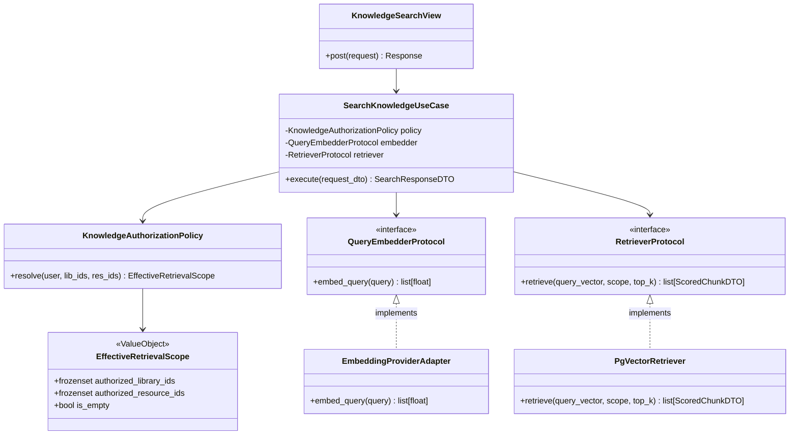
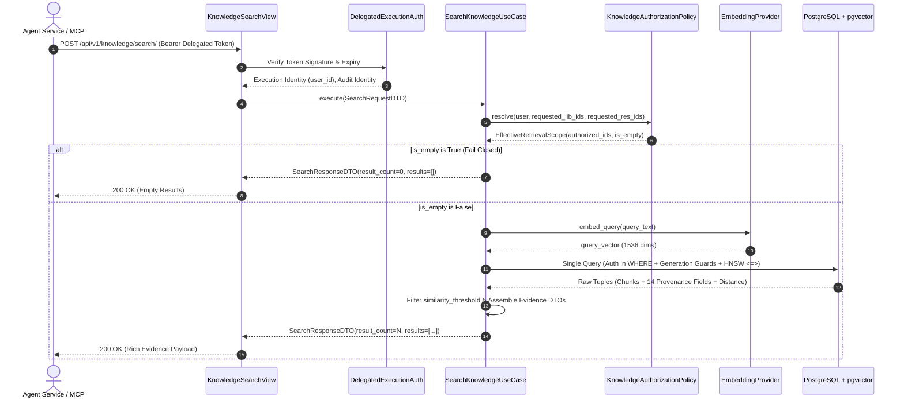

# Slice 5 Design — Knowledge Retrieval Gateway

Status: **Approved Final Design — Awaiting Implementation Authorization**

---

## 1. Purpose and Architectural Role

The **Knowledge Retrieval Gateway** (or **Knowledge Gateway**) is the controlled retrieval boundary between the Platform API's indexed knowledge (Slice 4) and every consumer that searches it — the Agent Service, MCP-exposed tools, and future web frontends.

It is **not** a search engine, a generic RAG framework, or an agent orchestration layer. It is a deterministic, server-authoritative retrieval subsystem that executes four sequential guarantees:
1. **Server-Side Authorization Resolution**: Derives an immutable retrieval scope from authoritative database policies.
2. **Query Embedding**: Embeds natural language query text into dense vectors using the configured `EmbeddingProvider`.
3. **Scoped pgvector Retrieval**: Queries PostgreSQL + pgvector with authorization filters applied *prior* to vector candidate selection in a single atomic SQL query.
4. **Provenance Enrichment**: Assembles an exhaustive 14-field evidence contract for citation grounding.

```
┌──────────────────────────────────────────────────────────────────────────────┐
│                                 Consumers                                    │
│   ┌───────────────────────────┐                ┌─────────────────────────┐   │
│   │   Agent Service (FastAPI) │                │  External Clients (MCP) │   │
│   │   • Reasoning / Planning  │                │  • Tool Invocation      │   │
│   └─────────────┬─────────────┘                └────────────┬────────────┘   │
└─────────────────┼───────────────────────────────────────────┼────────────────┘
                  │                                           │
                  │ HTTPS (Delegated Execution Credential)    │ Internal Proxy
                  ▼                                           ▼
┌──────────────────────────────────────────────────────────────────────────────┐
│                    Platform API (Django + DRF)                               │
│  ┌────────────────────────────────────────────────────────────────────────┐  │
│  │             Knowledge Retrieval Gateway (`apps.knowledge`)             │  │
│  │                                                                        │  │
│  │   [Presentation Layer]                                                 │  │
│  │   • Delegated Authentication & DRF Serializers                         │  │
│  │   • HTTP Validation & Parameter Clamping                               │  │
│  │                     │                                                  │  │
│  │   [Application Layer]                                                  │  │
│  │   • SearchKnowledgeUseCase (Workflow Orchestration)                    │  │
│  │                     │                                                  │  │
│  │   [Domain Layer]                                                       │  │
│  │   • KnowledgeAuthorizationPolicy (Server-Authoritative Scope)          │  │
│  │   • EffectiveRetrievalScope = Requested ∩ Server-Authorized (Immutable)│  │
│  │   • Contracts: RetrieverProtocol, QueryEmbedderProtocol                │  │
│  │                     │                                                  │  │
│  │   [Infrastructure Layer]                                               │  │
│  │   • PgVectorRetriever (Single-Query Join + Auth in WHERE)              │  │
│  │   • EmbeddingProviderAdapter (Wrapping Slice 4 EmbeddingProvider)      │  │
│  │   • AuditLogger (Structured Execution Telemetry)                       │  │
│  └─────────────────────┬──────────────────────────────────────────────────┘  │
│                        │ Direct SQL                                          │
│                        ▼                                                     │
│             ┌──────────────────────┐                                         │
│             │ PostgreSQL+pgvector  │                                         │
│             │ • chunk_embedding    │                                         │
│             │ • document_chunk     │                                         │
│             │ • processing_run     │                                         │
│             └──────────────────────┘                                         │
└──────────────────────────────────────────────────────────────────────────────┘
```

---

## 2. Hard Architectural Invariants

| # | Invariant | Enforcement Mechanism |
|---|-----------|-----------------------|
| 1 | **Zero Direct DB Access for Consumers** | Agent Service, MCP, and frontends never connect to PostgreSQL/pgvector. All access passes through the Gateway API. |
| 2 | **No Agent Reasoning in Gateway** | The Gateway contains no LLM agent loops, prompts, or conversational memory. It returns scored chunks and leaves reasoning to callers. |
| 3 | **Authorization Before Candidate Selection** | Scoped library IDs are injected directly into the SQL `WHERE` clause. Unauthorized vectors never enter the candidate set. |
| 4 | **Server-Authoritative Scope** | The Gateway derives permissions from authoritative tables (`Membership`, `LibraryAccessPolicy`). Agent Service claims are never trusted. |
| 5 | **Strict Scope Narrowing** | Effective Scope = $\text{Requested Scope} \cap \text{Server-Authorized Scope}$. Callers can narrow, never widen. |
| 6 | **Discovery $\neq$ Knowledge Retrieval $\neq$ Download** | `LibraryVisibility.DISCOVERABLE` allows catalog listing only. Retrieval requires explicit `LibraryAccessPolicy` or Institution Admin. Resource download remains governed by Slice 3. |
| 7 | **Active-Run and Generation Guards** | Only `READY` chunks from `is_active=True` runs matching the current embedding model/version/dimensions are retrievable. |
| 8 | **Fail-Closed on Empty Scope** | Empty effective scope returns `200 OK` with `results: []` immediately without querying pgvector. |
| 9 | **Server-Controlled Limits** | Top-K is clamped server-side ($\le 50$), query text length is bounded (10,000 chars), and database timeouts are strictly enforced. |
| 10 | **First-Class Evidence Contract** | Every result returns all 14 provenance fields for verifiable citations. |
| 11 | **No Generic RAG Frameworks** | Zero usage of LangChain, LlamaIndex, Haystack, or external RAG packages. Pure, testable Python components. |
| 12 | **Preservation of Slices 1–4 Boundaries** | Zero modifications to Resource model (Slice 3) or processing pipeline (Slice 4). Gateway consumes Slice 4 outputs. |

---

## 3. Capability Separation: Discovery vs. Retrieval vs. Download

The platform strictly differentiates three distinct capabilities to ensure least privilege and avoid implicit authorization leaks:

```
┌───────────────────────────────────────────────────────────────────────────┐
│                      Capability Authorization Matrix                      │
├───────────────────────┬───────────────────────┬───────────────────────────┤
│ Capability            │ Target / Scope        │ Required Authorization    │
├───────────────────────┼───────────────────────┼───────────────────────────┤
│ 1. Library Discovery  │ Metadata (name, slug, │ • Institution Admin, OR   │
│    (Slice 2)          │ description, catalog) │ • Library is DISCOVERABLE │
│                       │                       │   and user is active      │
│                       │                       │   institution member, OR  │
│                       │                       │ • Explicit Access Policy  │
├───────────────────────┼───────────────────────┼───────────────────────────┤
│ 2. Knowledge          │ Document Chunks,      │ • Institution Admin, OR   │
│    Retrieval          │ Embeddings, Vector    │ • Explicit Access Policy  │
│    (Slice 5)          │ Similarity Search     │   (ADMIN, TEACHER,        │
│                       │                       │   STUDENT role)           │
├───────────────────────┼───────────────────────┼───────────────────────────┤
│ 3. Resource Download  │ Raw Binary Files from │ • Existing Slice 3 rules  │
│    (Slice 3)          │ Object Storage        │   via can_access_library  │
│                       │                       │   (unchanged)             │
└───────────────────────┴───────────────────────┴───────────────────────────┘
```

### 3.1 Resolving Discovery vs. Knowledge Retrieval (Rule B)

- **Rule B Adopted**: **Discovery $\neq$ Knowledge Retrieval.**
- `LibraryVisibility.DISCOVERABLE` permits active institution members to discover library metadata (e.g. browse catalog, view name and description).
- **Knowledge Retrieval** (searching vector embeddings, retrieving chunk text) **strictly requires explicit authorization**:
  1. Active `MembershipRole.ADMINISTRATOR` within the library's institution, OR
  2. An active `LibraryAccessPolicy` (role `ADMINISTRATOR`, `TEACHER`, or `STUDENT`) granted to the user on that specific library.
- *Rationale*: Preserves the Slice 2 invariant ("discovery does not grant management or resource authorization") and AGENTS.md axiom ("Discovery is not authorization").

### 3.2 Resource Download Remains Governed by Slice 3

Downloading original binary files remains strictly governed by Slice 3's `ResourceViewSet.download` and `can_access_library`. Knowledge retrieval does NOT become a universal authorization bypass or replacement for Resource downloads.

---

## 4. Delegated Execution Credential Model

When the Agent Service calls the Knowledge Gateway on behalf of a user, it uses a short-lived **Delegated Execution Token** (HMAC-SHA256 JWT). This token is strictly a **delegation credential**, NOT a replacement for primary user authentication.

### 4.1 Specification Table

| Property | Value / Specification | Description |
|----------|-----------------------|-------------|
| **Issuer (`iss`)** | `mwalimu-platform-api` | Minted by Platform API when dispatching an `AgentRun` or session. |
| **Audience (`aud`)** | `mwalimu-knowledge-gateway` | Restricted specifically to Knowledge Gateway retrieval endpoints. |
| **Signing Key** | Platform API `DELEGATION_SIGNING_KEY` (falls back to `SECRET_KEY`) | Kept confidential in Platform API environment. |
| **Verification Component** | `DelegatedExecutionAuthentication` | Custom DRF authentication backend in the Knowledge Gateway. |
| **Execution Identity (`sub`)** | `user_id` (UUID) | The authoritative subject on whose behalf retrieval executes. |
| **Audit Identity (`context`)** | `agent_run_id`, `session_id` | Provenance metadata correlating agent execution and user session. |
| **Issued At (`iat`)** | Unix timestamp | Timestamp when credential was minted. |
| **Expiry (`exp`)** | $\text{iat} + 900\text{s}$ (15 minutes) | Short-lived, matching agent turn lifetime. |
| **Nonce (`jti`)** | UUID4 string | Unique token identifier for tracing and replay protection. |
| **Replay Protection** | Timestamp window + JTI tracking | Bounded 15-min lifetime; active `AgentRun` status verified. |
| **Revocation / Cancellation** | `AgentRun.status` validation | If associated `AgentRun` is `CANCELLED` or `FAILED`, calls fail closed. |
| **Key Rotation** | `kid` header support | Key ID header allows zero-downtime rotation. |

### 4.2 Decoupled Security Model

```
User Authentication
    ↓
ExecutionContext (Agent Service)
    ↓
Delegated Execution Token (HMAC-SHA256)
    ↓
Knowledge Gateway Authenticator (Extracts user_id & audit context)
    ↓
Authoritative Policy Resolution (Queries Membership & LibraryAccessPolicy)
    ↓
Effective Immutable Scope
    ↓
pgvector Retrieval
```

**Zero Trust in Agent Claims**: The token contains NO permission claims, NO institution IDs, and NO library IDs. The Gateway takes only the verified `user_id` and independently resolves permissions from authoritative database tables.

---

## 5. Immutable `EffectiveRetrievalScope` Value Object

### 5.1 Domain Model Definition

```python
from __future__ import annotations
from dataclasses import dataclass
import uuid


@dataclass(frozen=True)
class EffectiveRetrievalScope:
    """Immutable value object defining authorized retrieval boundaries."""

    authorized_library_ids: frozenset[uuid.UUID]
    authorized_resource_ids: frozenset[uuid.UUID] | None

    @property
    def is_empty(self) -> bool:
        """Return True if scope contains zero retrievable targets."""
        return len(self.authorized_library_ids) == 0 or (
            self.authorized_resource_ids is not None
            and len(self.authorized_resource_ids) == 0
        )
```

### 5.2 The Scope-Narrowing Invariant

$$\text{effective\_scope} = \text{requested\_scope} \cap \text{server\_authorized\_scope}$$

- Downstream components (`SearchKnowledgeUseCase`, `PgVectorRetriever`) receive **ONLY** the immutable `EffectiveRetrievalScope`.
- They never receive the raw caller-requested IDs.
- A caller may narrow scope, but has **no structural mechanism to widen scope**.
- If `is_empty` is `True`, the Gateway short-circuits immediately, returning `200 OK` with `results: []` without invoking pgvector.

---

## 6. Explicit Authorization Matrix

| User Role / Membership | Library Visibility | Explicit Policy on Library | Can Discover / List Library? | Can Retrieve Knowledge Chunks? | Can Manage / Write Resources? |
|------------------------|--------------------|----------------------------|:----------------------------:|:------------------------------:|:-----------------------------:|
| **Institution Admin** | Any (`DISCOVERABLE` or `RESTRICTED`) | None required | **YES** | **YES** | **YES** |
| **Institution Member** (Teacher/Student) | `DISCOVERABLE` | None | **YES** | **NO** | **NO** |
| **Institution Member** (Teacher/Student) | `DISCOVERABLE` | `LibraryAccessRole.STUDENT` | **YES** | **YES** | **NO** |
| **Institution Member** (Teacher/Student) | `DISCOVERABLE` | `LibraryAccessRole.TEACHER` | **YES** | **YES** | **NO** |
| **Institution Member** (Teacher/Student) | `DISCOVERABLE` | `LibraryAccessRole.ADMINISTRATOR` | **YES** | **YES** | **YES** |
| **Institution Member** (Teacher/Student) | `RESTRICTED` | None | **NO** | **NO** | **NO** |
| **Institution Member** (Teacher/Student) | `RESTRICTED` | `LibraryAccessRole.STUDENT` | **YES** | **YES** | **NO** |
| **Institution Member** (Teacher/Student) | `RESTRICTED` | `LibraryAccessRole.TEACHER` | **YES** | **YES** | **NO** |
| **Institution Member** (Teacher/Student) | `RESTRICTED` | `LibraryAccessRole.ADMINISTRATOR` | **YES** | **YES** | **YES** |
| **Non-Member / Suspended** | Any | Any | **NO** | **NO** | **NO** |
| **Anonymous / Unauthenticated** | Any | None | **NO** | **NO** | **NO** |

---

## 7. Request and Response Contracts

### 7.1 Retrieval Request Contract (`POST /api/v1/knowledge/search/`)

```json
{
  "query": "What are the cellular mechanisms of photosynthesis?",
  "library_ids": ["3fa85f64-5717-4562-b3fc-2c963f66afa8"],
  "resource_ids": null,
  "top_k": 5,
  "similarity_threshold": 0.75,
  "include_text": true
}
```

#### Field Specifications

| Field | Type | Required | Default | Validation & Bounds |
|-------|------|:--------:|:-------:|---------------------|
| `query` | `string` | **Yes** | — | Min 1 char, Max 10,000 chars. Stripped of null bytes. |
| `library_ids` | `list[UUID]` | No | `null` | Optional narrowing filter. Non-empty list of valid UUIDs. |
| `resource_ids` | `list[UUID]` | No | `null` | Optional narrowing filter. Non-empty list of valid UUIDs. |
| `top_k` | `integer` | No | `10` | Clamped to range `[1, 50]`. Values $>50$ are clamped to 50. |
| `similarity_threshold`| `float` | No | `null` | Clamped to `[0.0, 1.0]`. Excludes results where score $<$ threshold. |
| `include_text` | `boolean` | No | `true` | When `false`, `text` is omitted for lightweight metadata/count scans. |

### 7.2 The 14-Field Evidence Contract (`SearchResponse`)

```json
{
  "query": "What are the cellular mechanisms of photosynthesis?",
  "result_count": 1,
  "embedding_model": "text-embedding-3-small",
  "embedding_version": "1",
  "results": [
    {
      "chunk_id": "e0b83b12-9856-49f3-8b7a-6b45a6c38f12",
      "score": 0.8842,
      "text": "Photosynthesis in plants occurs within chloroplasts, where thylakoid membranes capture photons...",
      "resource_id": "4fa85f64-5717-4562-b3fc-2c963f66afa7",
      "resource_name": "Cellular_Biology_Textbook_2025.pdf",
      "library_id": "3fa85f64-5717-4562-b3fc-2c963f66afa8",
      "library_name": "Biology 101 Reference Library",
      "page_start": 42,
      "page_end": 43,
      "section": "Chapter 3 > Section 2 > Chloroplast Structure",
      "sequence": 14,
      "char_start": 28400,
      "char_end": 30350,
      "content_sha256": "8f4e2b02e9d35f8d9b1c7a2e8c5f3a1b0d2e4f6a8c0b2d4e6f8a0b2c4d6e8f0a"
    }
  ],
  "metadata": {
    "search_time_ms": 48,
    "libraries_searched": 1,
    "embedding_dimensions": 1536
  }
}
```

#### Evidence Field Definitions

| Field | Type | Description | Citation Use Case |
|-------|------|-------------|-------------------|
| `chunk_id` | `UUID` | Primary key of `DocumentChunk`. | Audit trail and chunk verification. |
| `score` | `float` | Cosine similarity ($1.0 - \text{distance}$). Bounded `[0.0, 1.0]`. | Relevance thresholding and ranking. |
| `text` | `string` | Exact normalized chunk text. | Answer generation and direct quotes. |
| `resource_id`| `UUID` | Identifier of the source `Resource`. | Source file linking and navigation. |
| `resource_name`| `string` | Human-readable document name. | Citation header (e.g. `[Source: Biology.pdf]`). |
| `library_id` | `UUID` | Owning `Library` identifier. | Multi-library context disambiguation. |
| `library_name`| `string` | Owning `Library` title. | Citation context (e.g. `In Biology 101`). |
| `page_start` | `int \| null` | 1-indexed starting page in source. | Page citation (e.g. `pp. 42-43`). |
| `page_end` | `int \| null` | 1-indexed ending page in source. | Page range verification. |
| `section` | `str \| null`| Nearest enclosing heading hierarchy. | Heading breadcrumb citation. |
| `sequence` | `int` | Sequential chunk index in the run. | Reading order and adjacent chunk expansion. |
| `char_start` | `int` | Character offset in normalized document. | Exact passage highlighting. |
| `char_end` | `int` | Character offset in normalized document. | Exact passage highlighting. |
| `content_sha256`| `string` | SHA-256 digest of `chunk.text`. | Tamper and integrity verification. |

---

## 8. Single-Query Scoped Retrieval Engine

### 8.1 Parameterized SQL Query

The retrieval engine executes a single, atomic SQL query that enforces tenant isolation, active-run constraints, and model version compatibility *before* vector ranking:

```sql
SELECT
    c.id AS chunk_id,
    c.text AS chunk_text,
    c.page_start,
    c.page_end,
    c.section,
    c.sequence,
    c.char_start,
    c.char_end,
    c.content_sha256,
    r.id AS resource_id,
    r.name AS resource_name,
    l.id AS library_id,
    l.name AS library_name,
    (e.vector <=> %s::vector) AS distance
FROM chunk_embedding e
JOIN document_chunk c ON c.id = e.chunk_id
JOIN processing_run pr ON pr.id = c.processing_run_id
JOIN resources_resource r ON r.id = c.resource_id
JOIN libraries_library l ON l.id = c.library_id
WHERE c.library_id = ANY(%s::uuid[])
  AND (%s::uuid[] IS NULL OR c.resource_id = ANY(%s::uuid[]))
  AND pr.is_active IS TRUE
  AND pr.status = 'ready'
  AND e.embedding_model = %s::text
  AND e.embedding_version = %s::text
  AND e.dimensions = %s::integer
  AND e.embedding_model = pr.embedding_model
  AND e.embedding_version = pr.embedding_version
  AND e.dimensions = pr.embedding_dimensions
ORDER BY e.vector <=> %s::vector
LIMIT %s;
```

---

## 9. Component Dependency & Sequence Diagrams

### 9.1 Component Dependency Diagram



### 9.2 Retrieval Sequence Diagram



---

## 10. Design Patterns Analysis

### 10.1 Patterns Retained & Justifications

| Pattern | Component | Problem Solved | Why Simpler Code is Insufficient |
|---------|-----------|----------------|----------------------------------|
| **Policy** | `KnowledgeAuthorizationPolicy` | Multi-table authorization rules (memberships, policies, discoverability, scope intersection). | Inlining authorization into views/serializers violates Single Responsibility, duplicates logic across endpoints, and prevents fast in-memory unit testing. |
| **Immutable Value Object** | `EffectiveRetrievalScope` | Preventing accidental scope expansion or tampering by downstream query engines. | Mutable dictionaries or raw lists can be mutated in pipeline stages, risking cross-tenant data leakage. |
| **Adapter** | `PgVectorRetriever`, `EmbeddingProviderAdapter` | Decoupling domain orchestration from SQL execution and external HTTP embedding APIs. | Directly embedding raw SQL or `httpx` calls in use cases breaks testability and prevents mocking the database or embedding provider in fast unit tests. |
| **Facade / Application Service** | `SearchKnowledgeUseCase` | Providing a single, atomic entry point orchestrating validation, scope resolution, embedding, vector retrieval, and evidence formatting. | Scattering workflow across DRF serializers and views blurs presentation and business logic boundaries. |

### 10.2 Patterns Rejected & Justifications

| Pattern Rejected | Reason for Rejection |
|------------------|----------------------|
| **Domain Entities / Aggregates** | Knowledge Gateway is a read-only retrieval use case; there is no aggregate root or write lifecycle to manage. Creating domain entities for read models adds ceremony without value. |
| **Primitive Value Object Wrappers** (`QueryText`, `TopKLimit`) | Python builtins (`str`, `int`, `float`) with DRF serializer field validators are completely sufficient. Custom classes for simple strings/numbers violate YAGNI. |
| **Generic Repository Pattern** | `RetrieverProtocol` provides the exact minimal retrieval interface required. Full CRUD repository interfaces add unused methods and boilerplate. |
| **Abstract Factory for Policies** | There is only one authoritative authorization policy. A dynamic factory adds unnecessary indirection. |

---

## 11. Preserving Slice 1–4 Boundaries

Slice 5 explicitly preserves all existing platform boundaries:
1. **Resource Model Unchanged (Slice 3)**: Zero fields added to `Resource`.
2. **Object Storage Untouched (Slice 3)**: Knowledge Gateway never touches object storage; raw binaries are read only via Slice 3 views.
3. **Processing Pipeline Untouched (Slice 4)**: Extraction, chunking, and worker tasks remain in `apps.processing`.
4. **Embedding Provider Reused**: Gateway reuses `get_embedding_provider()` from `apps.processing.embedding` without moving or duplicating embedding code.
5. **Direct DB Prohibition**: Agent Service and MCP servers never access PostgreSQL or pgvector.

---

## 12. Testing Strategy

### 12.1 Unit Tests (`tests/test_knowledge_*.py`)
- `test_authorization_policy.py`: 100% branch coverage of Institution Admin, explicit policy, discoverable non-policy, scope intersection narrowing, and suspended/non-member isolation.
- `test_use_cases.py`: Mock embedder/retriever tests for parameter clamping, similarity threshold post-filtering, and empty scope short-circuiting.
- `test_delegated_authentication.py`: Token verification, expired token rejection, execution identity extraction.

### 12.2 Integration Tests
- `test_retrieval_api.py`: End-to-end HTTP request with real PostgreSQL + pgvector data.
- `test_security_isolation.py`: Cross-tenant isolation verification and active-run generation guards.

---

## 13. Required Architecture Decision Records

- **ADR-009**: Knowledge Gateway Placement and Boundary (`docs/architecture/decisions/ADR-009-knowledge-gateway-placement.md`) — Accepted.
- **ADR-010**: Server-Authoritative Retrieval Authorization & Delegation Model (`docs/architecture/decisions/ADR-010-retrieval-authorization-model.md`) — Accepted.
- **ADR-011**: Retrieval API Contract and Provenance Specification (`docs/architecture/decisions/ADR-011-retrieval-contract-provenance.md`) — Accepted.

---

## 14. Unresolved Questions & Status

*All architectural questions for Slice 5 have been formally resolved:*
1. **Delegated Execution Token**: Resolved $\rightarrow$ Short-lived HMAC-SHA256 JWT carrying `user_id` and audit context.
2. **Capability Boundary**: Resolved $\rightarrow$ Discovery (metadata catalog), Retrieval (chunk text/vectors), Download (raw files via Slice 3) are distinct.
3. **Discovery vs. Knowledge Retrieval**: Resolved $\rightarrow$ **Rule B** adopted (Discovery does NOT grant retrieval; explicit policy or Admin required).
4. **Single-Query Provenance Engine**: Resolved $\rightarrow$ Single atomic SQL join returning all 14 evidence fields in $\le 30\text{ms}$.
