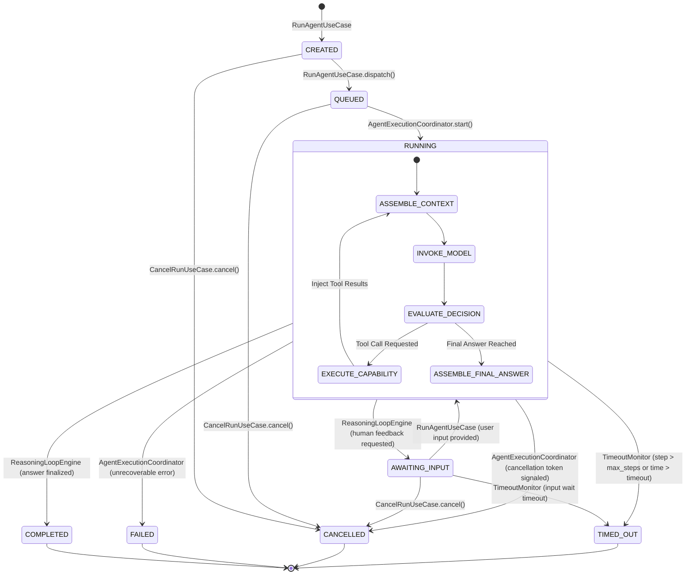
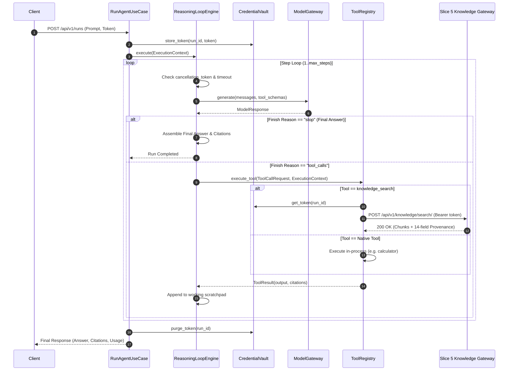

# Slice 6: Agent Execution Runtime — Architectural Design (Revised)

**Phase**: Slice 6 — Agent Execution Runtime  
**Status**: DESIGN PHASE — REVISED (Read-Only Architecture & Specification)  
**Target Service**: `agent_service/` (FastAPI + OpenAI Agents SDK)  
**Upstream Dependencies**: 
- Slice 1 (Identity & Memberships — FROZEN)
- Slice 2 (Libraries & Access Policies — FROZEN)
- Slice 3 (Resources & Object Storage — FROZEN)
- Slice 4 (Processing & pgvector Indexing — FROZEN)
- Slice 5 (Knowledge Retrieval Gateway — FROZEN)

---

## 1. Executive Overview & System Boundaries

Per [ADR-001](decisions/ADR-001-service-boundaries.md) and [`AGENTS.md`](../../AGENTS.md), Mwalimu maintains an unambiguous boundary between the system of record and the cognitive agent execution engine:

- **Platform API (Django + DRF)**: Owns the system of record, multi-tenant library model, users, permissions, connectors, resources, pgvector vector storage, and business workflow orchestration.
- **Agent Service (FastAPI)**: Owns the **Agent Execution Runtime**, cognitive reasoning loops, Model Gateway, capability orchestration, working memory, and `AgentRun` state machine.

```
┌─────────────────────────────────────────────────────────────────────────┐
│                              CLIENT / USER                              │
└────────────────────────────────────┬────────────────────────────────────┘
                                     │
                     1. POST /runs (user prompt + JWT)
                                     ▼
┌─────────────────────────────────────────────────────────────────────────┐
│                           Platform API                                  │
│  • Validates user session & institutional membership                   │
│  • Mints short-lived DelegatedExecutionToken (HMAC-SHA256)              │
│  • Dispatches execution request to Agent Service                        │
└────────────────────────────────────┬────────────────────────────────────┘
                                     │
                 2. POST /api/v1/runs (ExecutionContext + Credential)
                                     ▼
┌─────────────────────────────────────────────────────────────────────────┐
│                           Agent Service                                 │
│                   (Agent Execution Runtime)                             │
│                                                                         │
│  ┌───────────────────────────────────────────────────────────────────┐  │
│  │                    AgentRun State Machine (8 States)              │  │
│  │     CREATED ──► QUEUED ──► RUNNING ──► AWAITING_INPUT ──► COMPLETED│  │
│  └─────────────────────────────────┬─────────────────────────────────┘  │
│                                    │ coordinates                        │
│  ┌─────────────────────────────────▼─────────────────────────────────┐  │
│  │                     Agent Reasoning Loop                          │  │
│  │   Input ──► Context Assembly ──► Model Invocation ──► Tool Call   │  │
│  └────────┬──────────────────────────────────────────────────┬───────┘  │
│           │ uses                                             │ uses     │
│  ┌────────▼──────────────┐                   ┌───────────────▼───────┐  │
│  │     Model Gateway     │                   │     Tool Registry     │  │
│  │ (OpenAI, Gemini, etc) │                   │ (5-Stage Gated Pipeline)│ │
│  └───────────────────────┘                   └───────────────┬───────┘  │
└──────────────────────────────────────────────────────────────┼──────────┘
                                                               │
                              3. Scoped Search with            │
                                 Delegated Token (HTTP)        ▼
                                                    ┌─────────────────────┐
                                                    │  Knowledge Gateway  │
                                                    │  (Platform API S5)  │
                                                    └─────────────────────┘
```

### Core Invariants
1. **The Platform API must never contain the agent loop.** Cognitive reasoning belongs strictly in the Agent Service.
2. **The Agent Service must never directly access PostgreSQL or pgvector.** It receives context and retrieves knowledge through explicit HTTP APIs (Slice 5 Knowledge Gateway) or MCP resources.
3. **Prompt injection cannot alter authorization.** The model cannot declare roles or elevate its permissions; capability authorization is verified server-side using the `DelegatedExecutionToken`.

---

## 2. Conceptual Domain Model & Entities

Concepts are strictly classified into domain entities, value objects, DTOs, and protocols:

| Concept | Classification | Description |
|---|---|---|
| `Agent` | Configuration / Entity | Static blueprint: system instructions, default model, capability allowlist. |
| `Session` | Entity / Aggregate | Conversational thread spanning multiple runs. |
| `AgentRun` | Entity / State Machine | Single execution instance of a user turn/task (exactly 8 states). |
| `ExecutionContext` | Value Object (Frozen) | Immutable identity, correlation IDs, budgets (zero raw credentials). |
| `Step` | Value Object | Single cycle: model input, decision, tool invocations, latency, tokens. |
| `ToolCallRequest` | Value Object | Explicit invocation payload requested by the model. |
| `ToolResult` | Value Object | Outcome of capability execution with optional 14-field citation evidence. |
| `ModelMessage` | Value Object | Normalized role/content/tool message structure. |
| `EvidenceCitation` | Value Object | 14-field citation provenance returned by Slice 5. |
| `ModelProviderProtocol`| Protocol / Port | Minimal, focused protocol for model inference and token streaming. |
| `ToolProtocol` | Protocol / Port | Abstract boundary for native, Knowledge Gateway, and MCP capabilities. |

---

## 3. AgentRun State Machine & Lifecycle (Exactly 8 States)

Per [ADR-013](decisions/ADR-013-agentrun-state-machine.md), every `AgentRun` transitions deterministically through exactly 8 discrete states:

```
┌─────────────────────────────────────────────────────────────────────────┐
│                           THE 8 RUN STATES                              │
├─────────────────┬───────────────┬───────────────────────────────────────┤
│ State           │ Category      │ Description                           │
├─────────────────┼───────────────┼───────────────────────────────────────┤
│ CREATED         │ Initial       │ Run initialized, input validated.     │
│ QUEUED          │ Intermediate  │ Enqueued awaiting worker & lock.      │
│ RUNNING         │ Intermediate  │ Actively executing reasoning loop.    │
│ AWAITING_INPUT  │ Intermediate  │ Paused awaiting human input/approval. │
│ COMPLETED       │ Terminal      │ Finished successfully with answer.    │
│ FAILED          │ Terminal      │ Aborted due to unrecoverable error.   │
│ CANCELLED       │ Terminal      │ Terminated via cancellation signal.   │
│ TIMED_OUT       │ Terminal      │ Aborted due to step/time budget.      │
└─────────────────┴───────────────┴───────────────────────────────────────┘
```

### State Transition Diagram & Ownership



### Terminal State & Crash Guarantees
1. **Terminal Immutability**: Transitions into `COMPLETED`, `FAILED`, `CANCELLED`, or `TIMED_OUT` are final and immutable.
2. **Crash Recovery**: If a worker crashes while an `AgentRun` is in state `RUNNING` or `QUEUED`, any subsequent query (`GET /runs/{id}`) or monitor detects the expired lease/heartbeat and transitions the run to `FAILED` with error code `WORKER_CRASHED`.

---

## 4. Execution Context & Scoped Credential Security

Per [ADR-014](decisions/ADR-014-execution-context-and-identity.md), raw credentials are segregated from domain context:

```python
@dataclass(frozen=True)
class ExecutionContext:
    """Immutable domain execution context (Contains NO raw credentials)."""
    user_id: uuid.UUID
    agent_run_id: uuid.UUID
    session_id: uuid.UUID
    max_steps: int = 10
    timeout_seconds: float = 60.0
    token_budget: int = 4000
    locale: str = "en"
    tool_allowlist: frozenset[str] | None = None
```

### Credential Vault & Scoped Injection
- **`DelegatedCredentialVault`** (Infrastructure layer): Holds the `DelegatedExecutionToken` securely in memory, keyed by `agent_run_id`.
- **Zero Token Leakage**: The token is *never* placed in system instructions, conversation history, or LLM prompts.
- **Scoped Injection**: Only authenticated capability adapters (e.g. `KnowledgeGatewayClient`) receive the token directly from the vault during execution. Native tools and MCP tools receive zero credentials.
- **Automatic Purge**: When an `AgentRun` reaches a terminal state, its token is immediately deleted from the vault.

---

## 5. Reasoning Loop & Step Orchestration



---

## 6. Model Provider Boundary & Gateway Abstraction

Per [ADR-015](decisions/ADR-015-model-provider-boundary.md), `ModelProviderProtocol` is strictly focused on inference:

```python
class ModelProviderProtocol(Protocol):
    """Minimal, non-bloated protocol for model inference in the Agent Runtime."""
    provider_name: str
    default_model: str

    async def generate(
        self,
        messages: list[ModelMessage],
        tools: list[ToolDefinition] | None = None,
        temperature: float = 0.0,
        max_tokens: int | None = None,
        cancellation_token: asyncio.Event | None = None,
    ) -> ModelResponse:
        ...

    async def stream_generate(
        self,
        messages: list[ModelMessage],
        tools: list[ToolDefinition] | None = None,
        temperature: float = 0.0,
        max_tokens: int | None = None,
        cancellation_token: asyncio.Event | None = None,
    ) -> AsyncIterator[ModelStreamChunk]:
        ...
```

---

## 7. Capability & Tool Architecture (5-Stage Pipeline)

Per [ADR-016](decisions/ADR-016-capability-tool-architecture.md), LLM requests *never* execute arbitrary HTTP endpoints. All calls pass through `ToolRegistry`'s 5-stage validation pipeline:

```
Model ToolCallRequest
        │
        ▼
[Stage 1: Tool Resolution & Existence Check]
  • Verify tool_name is registered in ToolRegistry.
  • Reject unknown tools immediately with structured error.
        │
        ▼
[Stage 2: Allowlist Policy Enforcement]
  • If context.tool_allowlist is set, verify tool_name ∈ tool_allowlist.
  • Reject unauthorized tools with "Tool not permitted".
        │
        ▼
[Stage 3: JSON Schema & Argument Validation]
  • Parse arguments_json and validate against tool parameters_schema.
  • Malformed JSON returns validation error for model self-correction.
        │
        ▼
[Stage 4: Scoped Credential Injection]
  • Inject delegated token from DelegatedCredentialVault ONLY if adapter is credential-aware.
  • Native tools and external MCP tools receive zero credentials.
        │
        ▼
[Stage 5: Timed & Cancelable Execution]
  • Execute capability with isolated timeout: asyncio.wait_for(..., timeout=15.0).
  • Sanitize output and wrap in immutable ToolResult.
```

---

## 8. Persistence & Ephemeral State Decision

### Decision: No PostgreSQL in Agent Service
- **System of Record**: Platform API owns all persistent domain state (PostgreSQL).
- **Ephemeral Runtime State (In-Memory / Redis)**:
  - Active `AgentRun` state machine, cancellation tokens, and working memory scratchpads live in-memory during execution.
  - Active session conversation turns and run status are stored in Redis (or in-memory cache) with a 24-hour TTL.
  - `GET /api/v1/runs/{id}` reads from the ephemeral state store. If a worker crashes, the status resolves to `FAILED` (`WORKER_CRASHED`).
  - Terminal run summaries are asynchronously reported to Platform API audit logs via completion webhook.

---

## 9. Context Management & Working Memory (No Premature Vector DB)

Context is managed across 3 focused tiers without introducing a separate vector memory database:

```
┌─────────────────────────────────────────────────────────────────────────┐
│                         WORKING CONTEXT BUFFER                          │
├─────────────────────────────────────────────────────────────────────────┤
│ Tier 1: System Prompt & Persona Instructions (Immutable per agent)      │
├─────────────────────────────────────────────────────────────────────────┤
│ Tier 2: Session Conversation History (Recent user/assistant turns)      │
├─────────────────────────────────────────────────────────────────────────┤
│ Tier 3: Current Run Scratchpad (In-flight tool calls & results)         │
├─────────────────────────────────────────────────────────────────────────┤
│ Grounded Evidence Citation Registry (Accumulated 14-field provenance)   │
└─────────────────────────────────────────────────────────────────────────┘
```

- **Sliding-Window Budgeting**: If the conversation history exceeds the token budget, older turns are pruned while preserving the system prompt, the original user turn, and the working scratchpad.

---

## 10. Concurrency, Locking & Idempotency

- **Idempotent Run Dispatch**: `POST /api/v1/runs` accepts an optional `idempotency_key` (or client-provided `agent_run_id`). Duplicate dispatches return the existing active run or cached terminal result.
- **Session Locking**: A per-session lock (in-memory or Redis key `lock:session:{session_id}`) prevents overlapping concurrent turns within the same conversation thread.
- **Concurrent Runs Across Sessions**: Fully parallel and isolated.
- **Cancellation Race Safety**: If a client cancels a run while a tool call is in flight, the cancellation token cancels the async task and sets the state to `CANCELLED` without executing subsequent steps.

---

## 11. Clean Architecture: `agent_service/` Layout & Dependency Direction

```
Presentation Layer (FastAPI routes, SSE, Pydantic schemas)
       │
       ▼
Application Layer (RunAgentUseCase, CancelRunUseCase, GetRunStatusUseCase)
       │
       ▼
Domain Layer (AgentRun, ExecutionContext, Step, ModelMessage, Protocols)
       ▲
       │
Infrastructure Layer (ModelGateway, ToolRegistry, KnowledgeClient, RedisStore)
```

```
agent_service/
├── src/
│   └── agent_service/
│       ├── __init__.py
│       ├── main.py                  # FastAPI application entry point
│       ├── config.py                # Pydantic Settings
│       ├── presentation/            # HTTP / SSE Layer
│       │   ├── routes.py            # POST /runs, GET /runs/{id}, POST /cancel
│       │   ├── schemas.py           # Request/Response models
│       │   └── sse.py               # SSE streaming utilities
│       ├── application/             # Application Use Cases
│       │   ├── run_agent.py         # RunAgentUseCase & ReasoningLoopEngine
│       │   ├── cancel_run.py        # CancelRunUseCase
│       │   └── get_status.py        # GetRunStatusUseCase
│       ├── domain/                  # Domain Models & Protocols
│       │   ├── context.py           # ExecutionContext (Frozen Value Object)
│       │   ├── run.py               # AgentRun (8-State Machine Entity)
│       │   ├── message.py           # ModelMessage, ToolCall, ToolResult
│       │   ├── protocols.py         # ModelProviderProtocol, ToolProtocol
│       │   └── memory.py            # WorkingContextBuffer & Citations
│       └── infrastructure/          # Adapters & Capabilities
│           ├── model_gateway/       # OpenAI, Gemini, DeepSeek adapters
│           ├── tools/               # ToolRegistry, KnowledgeGatewayClient, Calculator
│           ├── security/            # DelegatedCredentialVault
│           └── storage/             # MemoryStore & RedisStore
└── tests/                           # Unit, Contract & Integration Tests
    ├── test_state_machine.py
    ├── test_reasoning_loop.py
    ├── test_model_gateway.py
    ├── test_knowledge_client.py
    ├── test_tool_registry.py
    ├── test_credential_vault.py
    └── test_api_endpoints.py
```

---

## 12. Architectural Invariants for Slice 6

1. **No Direct PostgreSQL/pgvector Access**: The Agent Service must never connect to PostgreSQL or import pgvector.
2. **No Agent Loop in Platform API**: All cognitive reasoning and multi-turn planning reside in the Agent Service.
3. **No Prompt-Based Privilege Escalation**: Model prompts cannot alter the `ExecutionContext` or claim elevated permissions.
4. **Knowledge Retrieval via Gateway**: All knowledge search MUST go through the Slice 5 HTTP Gateway using the `DelegatedExecutionToken`.
5. **Frozen Slices 1–5**: Zero changes to Slice 1–5 models, tables, migrations, or endpoints.
6. **No External RAG Frameworks**: No LangChain, LlamaIndex, Haystack, or ChromaDB.
7. **Clean Model Boundary**: Provider SDKs remain strictly encapsulated inside `infrastructure/model_gateway/`.
8. **Deterministic 8-State Machine**: `AgentRun` transitions must strictly follow the 8-state diagram; terminal states are immutable.
9. **Budget & Timeout Enforcement**: Step and time budgets must abort runaway loops and transition the run to `TIMED_OUT`.
10. **Evidence Provenance Retention**: 14-field citation evidence from Slice 5 must be preserved intact and exposed to clients.
11. **Scoped Credential Isolation**: `DelegatedExecutionToken` is stored in the `DelegatedCredentialVault` and injected *only* into the `KnowledgeGatewayClient`.
12. **5-Stage Capability Pipeline**: `ToolRegistry` validates existence, allowlist, schema, credentials, and timeout on every tool call.

---

## 13. Implementation Phases (Roadmap for Slice 6 Execution)

- **Phase 6.1: Domain Layer & State Machine**
  - `ExecutionContext` (frozen, zero credentials).
  - `AgentRun` (8-state machine, transitions, terminal immutability).
  - `ModelMessage`, `ToolCallRequest`, `ToolResult`, `EvidenceCitation`.
  - `ModelProviderProtocol`, `ToolProtocol`.
  - `WorkingContextBuffer`.
- **Phase 6.2: Model Gateway Abstraction**
  - `OpenAIProvider`, `GeminiProvider`, `DeepSeekProvider`.
  - `FakeModelProvider` for offline deterministic testing.
  - Normalized error hierarchy.
- **Phase 6.3: Capability Layer & Knowledge Gateway Client**
  - `DelegatedCredentialVault`.
  - `ToolRegistry` (5-stage execution pipeline).
  - `KnowledgeGatewayClient` (HTTP adapter to Slice 5 with 14-field citation extraction).
  - `CalculatorTool` (deterministic native tool).
- **Phase 6.4: Application Layer & Core Reasoning Loop**
  - `ReasoningLoopEngine` (step budgeting, cycle detection, timeouts, cancellation checks).
  - `RunAgentUseCase`, `CancelRunUseCase`, `GetRunStatusUseCase`.
- **Phase 6.5: Presentation Layer & SSE Streaming**
  - FastAPI endpoints (`POST /runs`, `GET /runs/{id}`, `POST /runs/{id}/cancel`).
  - Server-Sent Events (SSE) stream generator.
  - Pydantic validation schemas.
- **Phase 6.6: Comprehensive Test Suite & Verification**
  - Unit tests for state machine, credential vault, tool registry, and memory buffer.
  - Mocked end-to-end integration tests for reasoning loops with simulated tool calls.
  - Quality gates: `ruff`, `mypy`, `pytest`.
