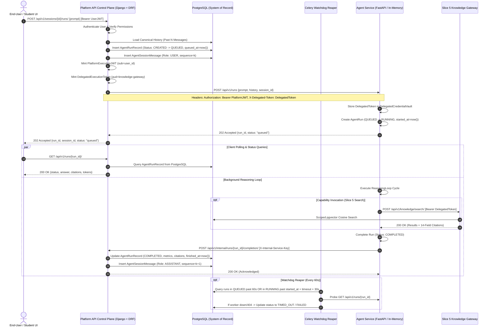

# Slice 7 Architecture & Design: Durable AgentRun Execution & Platform API ↔ Agent Service Integration (Revised)

## 1. Executive Summary & Core Invariants

Slice 7 bridges the **Platform API** (Django + DRF system of record) and the **Agent Service** (FastAPI cognitive reasoning runtime), establishing a production-grade, durable, multi-tenant agent execution architecture.

### Architectural Invariants (S7-01 through S7-10):
- **S7-01: System of Record Invariant**: The Platform API is the sole durable system of record.
- **S7-02: Ephemeral Runtime Invariant**: The Agent Service is an ephemeral execution engine, not a durable business-state owner. It must NEVER access PostgreSQL or pgvector directly.
- **S7-03: Disjoint Security Domains**: End-user credentials, Agent Service credentials, DelegatedExecutionTokens, and model provider credentials are completely separate security domains.
- **S7-04: Idempotent Completion Sync**: Completion synchronization from Agent Service to Platform API is strictly idempotent and safe under retries.
- **S7-05: Canonical Transcript Invariant**: The Platform API owns the canonical session transcript. The Agent Service receives only a runtime history projection and manages context-window token budgeting.
- **S7-06: Process-Local Execution Boundary**: Agent Service execution state is process-local in this slice. Horizontal multi-worker scaling is not assumed or claimed.
- **S7-07: Reuse-Before-Build Invariant**: Existing repository mechanisms (Django ORM, Celery, Redis, DRF, PostgreSQL, `mint_delegated_token`) must be reused before introducing any new infrastructure.
- **S7-08: Control Plane Invariant**: Frontend and student/teacher UIs communicate exclusively with Platform API, never directly with internal Agent Service infrastructure.
- **S7-09: Explicit Boundary Cancellation**: Cancellation across the Platform API $\rightarrow$ Agent Service boundary is cooperative, idempotent, and resilient to worker unreachability.
- **S7-10: Distinct Watchdog Timeout Semantics**: Watchdog timeout semantics distinguish queue waiting time (`queued_at`) from execution time (`started_at`).

---

## 2. End-to-End System Topology & Interaction Flow



---

## 3. Disjoint Credential Domains (S7-03)

```
Domain 1: User Session Authentication (User -> Platform API)
- Handled by DRF SimpleJWT (`SIMPLE_JWT` configuration in settings.py).
- Authenticates end-users, teachers, and students.

Domain 2: Platform-to-Agent Service Dispatch (Platform API -> Agent Service)
- Short-lived JWT signed with shared `JWT_SECRET_KEY` (iss: "mwalimu-platform-api", sub: str(user_id)).
- Authenticates the dispatch to `POST /api/v1/runs`.

Domain 3: Delegated Capability Execution (Agent Service -> Slice 5 Knowledge Gateway)
- Short-lived HMAC-SHA256 JWT minted by Platform API (`mint_delegated_token`).
- Audience: `mwalimu-knowledge-gateway`.
- Passed via `X-Delegated-Token`, stored in `DelegatedCredentialVault`, injected into `Authorization: Bearer` exclusively by `KnowledgeSearchTool`.
- NEVER reused for completion synchronization.

Domain 4: Internal Service Completion Sync (Agent Service -> Platform API)
- Machine-to-machine internal service key (`X-Internal-Service-Key` or dedicated internal service JWT).
- Authenticates `POST /api/v1/internal/runs/{run_id}/completion/`.

Domain 5: Model Provider Credentials (Agent Service -> LLM Providers)
- Provider API keys stored exclusively in Agent Service environment variables (`DEEPSEEK_API_KEY`, etc.).
```

---

## 4. Platform API Domain Models (`platform_api/apps/agents/models.py`)

### 4.1 `AgentSession` (Conversational Thread)
- `id`: `UUIDField`, Primary Key, default `uuid.uuid4`
- `user`: `ForeignKey` to `users.User`, `on_delete=CASCADE`
- `institution`: `ForeignKey` to `institutions.Institution`, `on_delete=CASCADE`
- `primary_library`: `ForeignKey` to `libraries.Library`, null=True, blank=True, `on_delete=SET_NULL`
- `title`: `CharField`, max_length=255
- `status`: `CharField`, choices: `ACTIVE`, `ARCHIVED`, default=`ACTIVE`
- `metadata`: `JSONField`, default=dict, blank=True
- `created_at`: `DateTimeField`, auto_now_add=True
- `updated_at`: `DateTimeField`, auto_now=True

*Indexes*: `(user, -updated_at)`, `(institution, -updated_at)`

---

### 4.2 `AgentRunRecord` (Durable Run Ledger)
- `id`: `UUIDField`, Primary Key, default `uuid.uuid4` (matches `agent_run_id`)
- `session`: `ForeignKey` to `AgentSession`, related_name="runs", `on_delete=CASCADE`
- `user`: `ForeignKey` to `users.User`, `on_delete=CASCADE`
- `prompt`: `TextField`
- `status`: `CharField`, choices: `CREATED`, `QUEUED`, `RUNNING`, `AWAITING_INPUT`, `COMPLETED`, `FAILED`, `CANCELLED`, `TIMED_OUT`, default=`CREATED`
- `answer`: `TextField`, null=True, blank=True
- `citations`: `JSONField`, default=list, blank=True (14-field citation objects)
- `error_code`: `CharField`, max_length=100, null=True, blank=True
- `error_message`: `TextField`, null=True, blank=True
- `step_count`: `PositiveIntegerField`, default=0
- `prompt_tokens`: `PositiveIntegerField`, default=0
- `completion_tokens`: `PositiveIntegerField`, default=0
- `total_tokens`: `PositiveIntegerField`, default=0
- `timeout_seconds`: `FloatField`, default=60.0
- `max_steps`: `PositiveIntegerField`, default=10
- `created_at`: `DateTimeField`, auto_now_add=True
- `queued_at`: `DateTimeField`, auto_now_add=True
- `started_at`: `DateTimeField`, null=True, blank=True
- `finished_at`: `DateTimeField`, null=True, blank=True

*Indexes*: `(session, -created_at)`, `(user, -created_at)`, `(status, started_at)`, `(status, queued_at)`

---

### 4.3 `AgentSessionMessage` (Canonical Transcript)
- `id`: `UUIDField`, Primary Key, default `uuid.uuid4`
- `session`: `ForeignKey` to `AgentSession`, related_name="messages", `on_delete=CASCADE`
- `run`: `ForeignKey` to `AgentRunRecord`, null=True, blank=True, `on_delete=SET_NULL`
- `role`: `CharField`, choices: `user`, `assistant`, `system`
- `content`: `TextField`
- `citations`: `JSONField`, default=list, blank=True
- `sequence`: `PositiveIntegerField`
- `created_at`: `DateTimeField`, auto_now_add=True

*Constraints & Indexes*: `UniqueConstraint(fields=['session', 'sequence'], name='unique_session_sequence')`

---

## 5. Idempotent Completion Synchronization (S7-04)

### Endpoint: `POST /api/v1/internal/runs/{run_id}/completion/`
- Authenticated via `InternalServiceAuthentication`.
- Payload schema:
  ```json
  {
    "status": "completed",
    "answer": "The synthesized answer...",
    "citations": [...],
    "error_code": null,
    "error_message": null,
    "step_count": 2,
    "prompt_tokens": 930,
    "completion_tokens": 352,
    "total_tokens": 1282,
    "started_at": "2026-08-23T15:00:00Z",
    "finished_at": "2026-08-23T15:00:04Z"
  }
  ```
- **Idempotency Flow**:
  1. Opens `with transaction.atomic():`.
  2. Acquires row lock: `run_record = AgentRunRecord.objects.select_for_update().get(id=run_id)`.
  3. If `run_record.is_terminal`:
     - If incoming status matches existing status: return `200 OK` (idempotent replay, no-op).
     - If incoming status conflicts with terminal state (e.g. run already `CANCELLED` or `TIMED_OUT`): do NOT overwrite terminal state; log conflict and return `200 OK`.
  4. If `run_record` is active (`QUEUED`, `RUNNING`, `AWAITING_INPUT`):
     - Updates fields: `status`, `answer`, `citations`, `error_code`, `error_message`, `step_count`, `prompt_tokens`, `completion_tokens`, `total_tokens`, `started_at`, `finished_at`.
     - Appends assistant message to `AgentSessionMessage`:
       - Computes next `sequence = coalesce(max(sequence), 0) + 1`.
       - Inserts `AgentSessionMessage(session=run_record.session, run=run_record, role="assistant", content=payload.answer, citations=payload.citations, sequence=next_seq)`.
  5. Returns `200 OK`.

---

## 6. Watchdog Reconciliation Semantics (S7-10)

Implemented as a Celery task in `platform_api/apps/agents/tasks.py`:

```python
@shared_task(bind=True, acks_late=True, max_retries=3)
def reconcile_orphaned_agent_runs(self: Any) -> None:
    now = timezone.now()
    
    # 1. Reconcile stuck QUEUED runs
    queued_cutoff = now - timedelta(seconds=60)
    stuck_queued = AgentRunRecord.objects.filter(
        status="QUEUED",
        queued_at__lt=queued_cutoff,
    )
    for run in stuck_queued:
        run.status = "TIMED_OUT"
        run.error_code = "QUEUED_TIMEOUT"
        run.error_message = "Run was never dispatched or picked up by execution worker."
        run.finished_at = now
        run.save(update_fields=["status", "error_code", "error_message", "finished_at"])

    # 2. Reconcile stuck RUNNING runs (measured from started_at)
    # Filter runs where started_at is past timeout + 30s grace period
    stuck_running = AgentRunRecord.objects.filter(
        status="RUNNING",
        started_at__isnull=False,
    )
    for run in stuck_running:
        grace_period = run.timeout_seconds + 30.0
        if (now - run.started_at).total_seconds() > grace_period:
            # Probe Agent Service health
            is_alive = probe_agent_service_run(run.id)
            if not is_alive:
                run.status = "TIMED_OUT"
                run.error_code = "EXECUTION_TIMEOUT"
                run.error_message = f"Execution exceeded budget ({run.timeout_seconds}s) and worker is unreachable."
                run.finished_at = now
                run.save(update_fields=["status", "error_code", "error_message", "finished_at"])
```

---

## 7. Cooperative Cancellation across Boundary (S7-09)

When client invokes `POST /api/v1/runs/{run_id}/cancel/`:
1. Platform API checks ownership (`run_record.user == request.user`).
2. Inside `transaction.atomic()`:
   - If `run_record.is_terminal`: return `200 OK` (idempotent).
   - Update `run_record.status = 'CANCELLED'`, `run_record.error_code = 'CANCELLED'`, `run_record.finished_at = timezone.now()`.
3. Platform API dispatches synchronous best-effort cancellation to Agent Service:
   - `httpx.post(f"{AGENT_SERVICE_URL}/api/v1/runs/{run_id}/cancel", headers=...)`
   - If Agent Service responds 200: Agent Service `cancellation_token.set()` stops the local loop.
   - If Agent Service is unreachable: Platform API record is already marked `CANCELLED`; idempotent completion sync will discard any subsequent results.
4. Returns `200 OK`.

---

## 8. Process-Local Limitations (S7-06)

- **Agent Service Node-Local Execution**: Agent Service in-memory state is held in process memory (`InMemoryRunStore`).
- **Zero Premature Clustering**: Multi-node distributed execution is NOT claimed or assumed in Slice 7.
- **Worker Crash Handling**: If the process crashes, the Platform API watchdog cleanly transitions orphaned runs to terminal states in PostgreSQL.

---

## 9. Public Platform API Endpoints (S7-08)

1. **`POST /api/v1/sessions/`**: Create new conversational session.
2. **`GET /api/v1/sessions/`**: List user's sessions.
3. **`GET /api/v1/sessions/{id}/`**: Get session details and canonical transcript messages.
4. **`POST /api/v1/sessions/{id}/runs/`**: Submit prompt, insert `AgentRunRecord`, dispatch to Agent Service, return `202 Accepted`.
5. **`GET /api/v1/runs/{id}/`**: Query durable run snapshot from PostgreSQL.
6. **`POST /api/v1/runs/{id}/cancel/`**: Forward cooperative cancellation.
7. **`POST /api/v1/internal/runs/{id}/completion/`**: Internal authenticated completion synchronization callback.

---

## 10. Reuse-Before-Build Audit Table (S7-07)

| Requirement | Existing Repo Mechanism Inspected | Reused? | Decision & Rationale |
|---|---|:---:|---|
| **System of Record** | Django ORM + PostgreSQL (`settings.DATABASES`) | ✅ Yes | Direct use of Django models with strict indexes and transactional locks |
| **Vector Retrieval** | Slice 5 Knowledge Gateway (`/api/v1/knowledge/search/`) | ✅ Yes | Scoped vector search reused via HTTP without direct PostgreSQL access from Agent Service |
| **Delegated Token Minting** | `platform_api.apps.knowledge.authentication.mint_delegated_token` | ✅ Yes | Reused existing HMAC-SHA256 token generator |
| **Background Processing** | Celery + Redis (`platform_api.celery`) | ✅ Yes | Celery shared task infrastructure reused for periodic watchdog reaper |
| **User Authentication** | DRF SimpleJWT (`SIMPLE_JWT`) | ✅ Yes | Reused standard Bearer token authentication |
| **Transactional Idempotency** | Django `transaction.atomic()` & `select_for_update()` | ✅ Yes | Standard database row-level locking for completion sync and cancellation |
| **Inter-Service HTTP** | `httpx` (installed v0.28) | ✅ Yes | Async/sync HTTP client for Platform $\rightarrow$ Agent Service dispatch |
| **Agent Execution Engine** | Slice 6.5 Agent Service (`ReasoningLoop`, `ToolRegistry`) | ✅ Yes | Reused completely unchanged |
| **Distributed State Brokers** | Kafka / RabbitMQ / Redis PubSub / Dramatiq | ❌ No | **Rejected per YAGNI**: Single-process execution + PostgreSQL system of record satisfies all requirements |

---

## 11. Phased Implementation Plan for Slice 7

- **Phase 7.1**: Platform API Domain Models (`AgentSession`, `AgentRunRecord`, `AgentSessionMessage`) & Migrations.
- **Phase 7.2**: Inter-Service HTTP Client & Delegation Minting in Platform API.
- **Phase 7.3**: Canonical History Hydration & Idempotent Completion Callback Endpoint.
- **Phase 7.4**: Public Platform API DRF Endpoints (`/api/v1/sessions/`, `/api/v1/runs/`).
- **Phase 7.5**: Watchdog Reconciliation Celery Task (`reconcile_orphaned_agent_runs`).
- **Phase 7.6**: End-to-End Integration Testing, Regression Testing, and Architectural Audit.

---

**Status**: Revised Slice 7 architecture and design complete. Zero implementation code changed. Ready for review.
